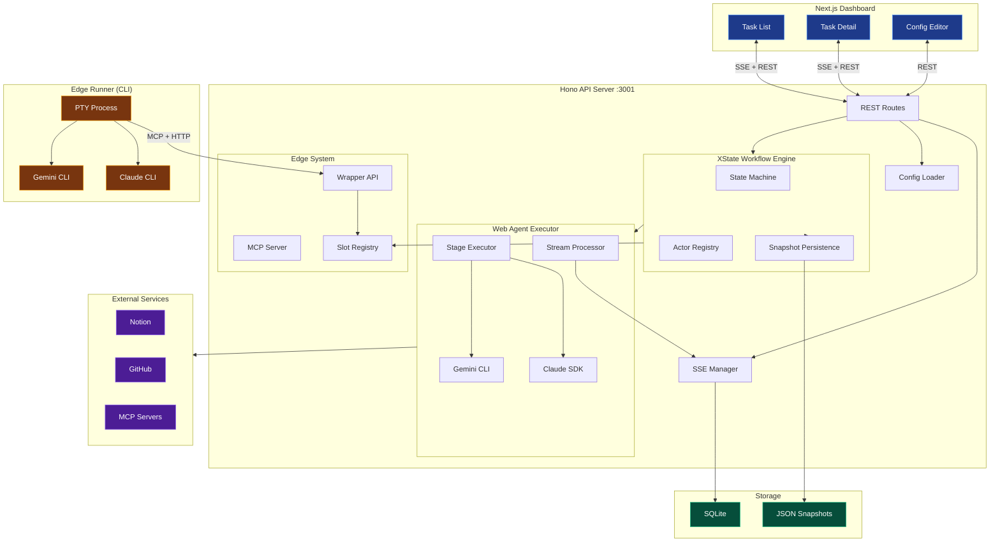
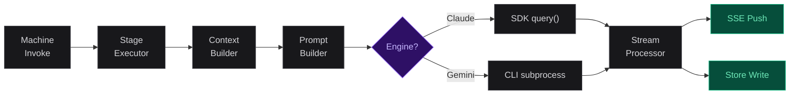

## Architecture

A monorepo with three packages: Hono API server (the engine), Next.js
dashboard (the interface), and a shared type package (the contract).

### System Topology



> **Server (apps/server)**
> Hono framework on port 3001. XState v5 state machine as workflow kernel.
> Claude Agent SDK + Gemini CLI as execution backends.
> SQLite for SSE history, JSON files for task snapshots.

> **Dashboard (apps/web)**
> Next.js + React. SSE-driven real-time stream with virtual scrolling.
> Config editor for pipelines, prompts, and system settings.

> **Shared (packages/shared)**
> TypeScript type definitions: Task, SSEMessage event types,
> API request/response contracts. Consumed by both packages.

> **Edge Runner**
> Standalone CLI that spawns Claude/Gemini via PTY. Communicates
> with the server via HTTP + MCP. Transcript sync keeps dashboard updated.

### State Machine Internals

The state graph is not hand-written. `pipeline-builder.ts` reads the
pipeline YAML and generates XState states dynamically:

```
# dynamic state generation
pipeline.stages[]
  -> buildPipelineStates()
    -> For each entry:
        PipelineStageConfig:
          "agent"         -> XState invoke state calling runAgent()
          "script"        -> XState invoke state calling runScript()
          "human_confirm" -> Wait state listening for CONFIRM / REJECT
          "condition"     -> XState always (eventless) transitions with expr-eval guards
          "pipeline"      -> XState invoke state calling runPipelineCall()
          "foreach"       -> XState invoke state calling runForeach()
        ParallelGroupConfig:
          -> XState parallel state (type: "parallel")
          -> Each child stage becomes an independent region
          -> All regions run concurrently; group completes when all finish
          -> Skip-if-done guards for retry recovery (parallelDone tracking)
    -> Wire transitions: entry[n] -> entry[n+1], last -> "completed"
    -> Apply routing overrides: on_reject_to, on_approve_to, retry.back_to
    -> Validate: no writes overlap in groups, no external back_to, no nested parallel
```

### Agent Execution Pipeline (Web Mode)



> **Context Builder**
> Constructs Tier 1 context (~500 tokens) from the stage's `reads`
> config. Task ID, description, branch path, and selected store values.

> **Prompt Builder**
> Assembles final prompt from 6 layers: global constraints, project rules,
> stage prompt, matched fragments, output schema, step prompts.

> **Stream Processor**
> Iterates over agent messages, pushes to SSE, handles interrupt-and-resume
> (up to 3 levels), enforces 5-minute inactivity timeout.

### Edge Execution Pipeline

In edge mode, the server doesn't run the agent. Instead:

```
# edge execution flow
1. State machine marks stage as "edge slot" (pending execution)
2. Edge Runner polls GET /api/edge/:taskId/next-stage
3. Server returns stage name + config (model, effort, etc.)
4. Runner spawns Claude/Gemini CLI with:
   - MCP config pointing to server's MCP endpoint
   - Stage options as CLI flags (--model, --effort, etc.)
   - Hooks settings for interrupt checking
5. Agent calls MCP tools:
   - get_stage_context -> receives system prompt + tier 1 context
   - report_progress -> streamed to dashboard via SSE
   - submit_stage_result -> writes output to store, advances pipeline
6. Runner syncs transcript (JSONL) back to server for dashboard display
```

### Persistence & Recovery

| Layer | Storage | Content | Purpose |
|---|---|---|---|
| Task Snapshots | JSON in data_dir/tasks/ | Full WorkflowContext + version | Restore state machine on restart |
| SSE History | SQLite sse_messages table | All SSE events | Replay for new connections |

```
# server restart recovery
1. Scan data_dir/tasks/*.json
2. For each non-terminal task -> restoreWorkflow()
3. Rebuild XState actor from saved state
4. "invoke" states -> downgrade to "blocked" (safe: no auto-reexecution)
5. Terminal tasks -> auto-cleanup from memory after 5 min
```

### Real-time Communication (SSE)

| Endpoint | Purpose | Limits |
|---|---|---|
| GET /api/stream/:taskId | Single task events | 10 concurrent, 30s heartbeat, history replay |
| GET /api/stream/tasks | Global task list changes | 100 concurrent |

### Configuration File Layout

```
# directory structure
config/
  pipelines/{name}/
    pipeline.yaml                # Pipeline definition
    prompts/
      system/{stage}.md          # Per-stage system prompts
      global-constraints.md      # Global behavioral constraints
  mcps/registry.yaml             # MCP server definitions
  prompts/fragments/*.md         # Reusable knowledge snippets
  claude-md/global.md            # Claude project rules
  gemini-md/global.md            # Gemini project rules
  edge-hooks.json                # Hook template for edge runner

~/.config/workflow-control/
  system-settings.yaml           # Paths, keys, defaults
```
