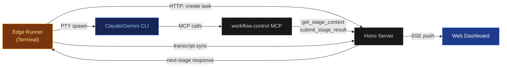

## Edge Runner

The Edge Runner executes pipeline stages locally in your terminal.
It spawns Claude or Gemini CLI processes via PTY, giving you direct
interactive access to the agent while the server orchestrates the pipeline.

### How it works



The runner polls the server for the next stage, spawns the appropriate CLI
process with an MCP connection back to the server, and the agent uses MCP
tools (`get_stage_context`, `submit_stage_result`) to receive
instructions and report results. Transcript events are synced back to the
server so the dashboard stays up to date.

### Usage

```bash
# trigger a new task

# Basic
pnpm edge -- --trigger "Add dark mode toggle" --pipeline pipeline-generator

# With Gemini engine
pnpm edge -- --trigger "Refactor auth module" --pipeline gemini-refactor --engine gemini

# Custom server URL
pnpm edge -- --trigger "Fix login bug" --pipeline claude-bugfix --server http://localhost:3001
```

```bash
# attach to existing task

# Resume a task by ID
pnpm edge -- <task-id>

# Paused tasks auto-resume on attach
```

### Command Mode

Press `Ctrl+\` during agent execution to enter command mode:

| Key | Action |
|---|---|
| c | Cancel task (same as Ctrl+C) |
| p | Pause & exit — keep task state, re-attach later |
| m | Send a message to the agent (interrupt with input) |
| q | Back to agent |

### Gate & Question Handling

When the pipeline reaches a `human_confirm` gate or the agent asks a
question, the runner switches to interactive prompt mode:

> **Gate**
> Options: `a` (approve), `r` (reject with optional reason),
> `f` (feedback). Gates can also be resolved from the dashboard —
> the runner polls and detects external resolution.

> **Question**
> The agent's question is displayed. Type your answer and press Enter.
> Questions can also be answered from the dashboard.

### Pipeline Options in Edge Mode

The server sends stage configuration to the runner. Supported options are
passed as CLI flags to Claude/Gemini:

| Option | Claude CLI | Gemini CLI |
|---|---|---|
| model | --model (haiku, sonnet, opus, or full name) | --model |
| effort | --effort (low, medium, high, max) | Not supported |
| permission_mode | --permission-mode / --dangerously-skip-permissions | --approval-mode |
| debug | --debug | --debug |
| disallowed_tools | --disallowed-tools | Not supported (use Policy Engine) |
| agents | --agents \<json\> | Not supported |

> **Important:** `max_turns`, `max_budget_usd`, and `thinking` are not supported
> by either CLI in interactive mode. These options are silently ignored in edge mode
> with a warning printed at stage start.

### Model Validation

If the configured model name is not in the known model list, the runner
prompts you to choose. Press Enter to use the configured value as-is,
or type a different model name.

### Web vs Edge: when to use which

| Scenario | Recommended |
|---|---|
| Hands-off execution, team visibility | Web mode |
| Debugging a pipeline or prompt | Edge mode |
| Interactive coding session | Edge mode |
| Long-running tasks overnight | Web mode |
| Testing a new pipeline config | Edge mode |
| CI/CD integration | Web mode (API) |
