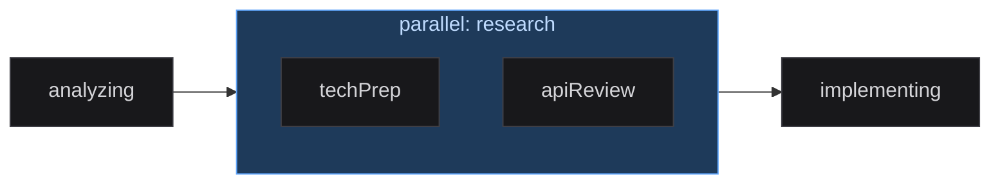

## Pipelines

A pipeline is a YAML file that defines the execution blueprint: which stages
to run, in what order, with what parameters, and how data flows between them.

> **Note:** The system ships with multiple built-in pipelines organized by engine (Claude / Gemini)
> and use case (Normal, Text, Bugfix, Refactor), plus lightweight Test pipelines for
> validation. Below we use `pipeline-generator` as the reference example.

### Structure

```yaml
# config/pipelines/pipeline-generator/pipeline.yaml (simplified)
name: "Claude Normal — Large Frontend Projects"
description: "Full-stack frontend pipeline using Claude SDK"
engine: claude

display:
  title_path: analysis.title
  completion_summary_path: prUrl

hooks: [format-on-write, safety-guard, protect-files]
skills: [security-review, performance-audit]

claude_md:
  global: global.md

stages:
  - name: analyzing
    type: agent
    model: claude-sonnet-4-6
    effort: high
    mcps: [notion, context7]
    runtime:
      engine: llm
      system_prompt: analysis
      writes: [analysis]
    outputs:
      analysis:
        fields:
          - { key: title, type: string, description: Task title }
          - { key: plan,  type: markdown, description: Implementation plan }

  - name: awaitingConfirm
    type: human_confirm
    runtime:
      engine: human_gate
      on_reject_to: analyzing
      max_feedback_loops: 3

  - name: branching
    type: script
    runtime:
      engine: script
      script_id: create_branch
      reads: { branchName: analysis.branchName }
      writes: [branch]

  - name: implementing
    type: agent
    model: claude-sonnet-4-6
    effort: high
    runtime:
      engine: llm
      system_prompt: implementation
      writes: [impl]
      reads: { plan: analysis.plan }
      agents:
        file-implementer:
          description: Implements a single file
          model: sonnet

  - name: pr_creation
    type: script
    runtime:
      engine: script
      script_id: pr_creation
      reads: { title: analysis.title, branch: branch }
```

### Stage Types

> **AI Agent**
> type: agent / engine: llm
>
> Invokes Claude or Gemini with a system prompt.
> - `system_prompt` — prompt file reference
> - `writes` / `reads` — data flow
> - `model`, `effort`, `permission_mode`
> - `mcps` — MCP servers to enable
> - `agents` — sub-agent definitions
> - `outputs` — structured output schema
> - `max_turns`, `max_budget_usd` — limits (web mode only)
> - `thinking` — extended reasoning (web mode only)

> **Script**
> type: script / engine: script
>
> Runs a registered automation handler. Deterministic and fast.
> - `script_id` — registered script name
> - `reads` — store paths mapped to inputs
> - `writes` — return fields to store
> - `args` — static parameters
> - `timeout_sec` — execution timeout

> **Human Gate**
> type: human_confirm / engine: human_gate
>
> Pauses pipeline for human review.
> - `on_reject_to` — where to go on rejection
> - `on_approve_to` — where to go on approval
> - `max_feedback_loops` — rejection limit before error
> - `notify` — Slack notification

> **Condition**
> type: condition / engine: condition
>
> Evaluates expression branches and routes to the first matching target.
> Uses `expr-eval` for safe expression evaluation (no `eval`).
> - `branches` — array of `{ when, to }` objects; exactly one must have `default: true`
> - Expressions use `store.xxx` to access the store, e.g. `store.score > 80`
> - Supports `and`, `or`, `==`, `!=`, `>`, `<`, `>=`, `<=` operators

> **Pipeline Call**
> type: pipeline / engine: pipeline
>
> Invokes another pipeline as a sub-task and waits for it to complete.
> The child pipeline inherits the parent's worktree and branch.
> - `pipeline_name` — ID of the pipeline to call
> - `reads` — map parent store paths to child pipeline's initial store keys
> - `writes` — fields to extract from child store back to parent store
> - `timeout_sec` — max wait time (default 300s)

> **Foreach**
> type: foreach / engine: foreach
>
> Iterates over an array in the store, running a sub-pipeline for each item.
> Depends on Pipeline Call internally.
> - `items` — store path to an array (e.g. `store.pr_list`)
> - `item_var` — key name for the current item in each sub-pipeline's store
> - `pipeline_name` — pipeline to run per item
> - `max_concurrency` — parallel item limit (default 1 = serial)
> - `collect_to` — store key for collected results array
> - `item_writes` — fields to extract from each sub-pipeline
> - `on_item_error` — `"fail_fast"` (default) or `"continue"`
> - `isolation` — `"shared"` (default) or `"worktree"`. When `"worktree"`, each item
>   gets its own git worktree and branch, preventing file conflicts with `max_concurrency > 1`.
>   After all items complete, worktrees are cleaned up but branches are preserved.
>   Collected results include `__branch` per item. Follow with an agent stage to merge/integrate.
> - `auto_commit` — auto-commit item changes on success (default `true` when isolation is worktree)

### Parallel Groups (Concurrent Execution)

Wrap multiple stages in a `parallel` block to run them concurrently.
All child stages start at the same time; the group completes when **all**
children finish.

```yaml
stages:
  - name: analyzing
    type: agent
    runtime:
      engine: llm
      system_prompt: analysis
      writes: [analysis]

  - parallel:
      name: research
      stages:
        - name: techPrep
          type: agent
          runtime:
            engine: llm
            system_prompt: tech_research
            writes: [techContext]
            reads: { plan: analysis.plan }
        - name: apiReview
          type: agent
          runtime:
            engine: llm
            system_prompt: api_audit
            writes: [apiAudit]
            reads: { plan: analysis.plan }

  - name: implementing
    type: agent
    runtime:
      engine: llm
      system_prompt: implementation
      writes: [impl]
      reads: { tech: techContext, api: apiAudit }
```

**Rules:**

| Rule | Reason |
|---|---|
| Child `writes` keys must not overlap | Concurrent writes to the same key cause data races |
| Children cannot `reads` from siblings | Sibling outputs are not available until the group completes |
| `retry.back_to` must reference a sibling within the same group | XState parallel regions cannot transition to external states |
| `human_confirm` stages are not allowed inside groups | Gates require exclusive pipeline control |
| Parallel groups cannot be nested | No parallel inside parallel |

**Data flow:** After the group completes, all child outputs are merged into
the store. Downstream stages can read from any child's writes normally.

**Retry & Recovery:** If a child stage fails and exhausts retries, the
entire group enters `blocked`. On RETRY, already-completed siblings are
skipped (tracked via `parallelDone` context); only the failed child re-runs.



### Stage Config Options

| Option | Web Mode | Edge Mode (Claude) | Edge Mode (Gemini) |
|---|---|---|---|
| model | SDK model | --model | --model |
| effort | SDK effort | --effort | Not supported |
| permission_mode | SDK permissionMode | --permission-mode | --approval-mode |
| debug | SDK debug | --debug | --debug |
| disallowed_tools | SDK disallowedTools | --disallowed-tools | Not supported |
| agents (sub-agents) | SDK agents | --agents \<json\> | Not supported |
| max_turns | SDK maxTurns | Not supported | Not supported |
| max_budget_usd | SDK maxBudgetUsd | Not supported | Not supported |
| thinking | SDK thinking | Not supported | Not supported |

> **Important:** Options marked "Not supported" in edge mode are silently ignored.
> The runner prints a warning listing which options were skipped for each stage.

### Data Flow

Stages exchange data through a central `store`. Stages never access the
store directly; they declare what they read and write:

```mermaid
flowchart LR
  subgraph analyzing ["Stage: analyzing"]
    A_Agent["AI Agent"] --> A_Out["Output JSON"]
    A_Out -->|"writes: [analysis]"| Store_A["store.analysis"]
  end

  subgraph implementing ["Stage: implementing"]
    Store_A -->|"reads: {plan: analysis.plan}"| B_Ctx["Tier 1 Context"]
    B_Ctx --> B_Agent["AI Agent"]
    B_Agent --> B_Out["Output JSON"]
    B_Out -->|"writes: [impl]"| Store_B["store.impl"]
  end

  subgraph pr ["Stage: pr_creation"]
    Store_A -->|"reads: {title: analysis.title}"| C_In["Script Inputs"]
    Store_B -->|"reads: {branch: impl.branch}"| C_In
    C_In --> C_Script["Script"]
    C_Script -->|"writes: [pr]"| Store_C["store.pr"]
  end

  classDef store fill:#1e3a8a,stroke:#3b82f6,color:#93c5fd
  classDef agent fill:#064e3b,stroke:#10b981,color:#6ee7b7
  classDef default fill:#18181b,stroke:#3f3f46,color:#d4d4d8
  class Store_A,Store_B,Store_C store
  class A_Agent,B_Agent,C_Script agent
```



> **writes**
> Agent returns JSON. Engine extracts fields listed in `writes` and saves
> them to `store[field]`. Scripts return values filtered through `writes`.

> **reads**
> Mapping from input names to store paths: `{plan: "analysis.plan"}`.
> For agents: Tier 1 context. For scripts: `inputs` parameter.

> **outputs schema**
> Defines expected output structure. Auto-generates JSON format instructions
> in the prompt, and tells the dashboard how to render data (via `display_hint`).

**Parallel group data flow:** Child stages read from upstream, write independently,
and their outputs merge into the store after the group completes.

```mermaid
flowchart LR
  subgraph analyzing ["Stage: analyzing"]
    A_Agent["AI Agent"] --> A_Out["Output JSON"]
    A_Out -->|"writes: [analysis]"| Store_A["store.analysis"]
  end

  subgraph PG ["parallel: research"]
    direction TB
    subgraph techPrep ["techPrep"]
      Store_A -.->|"reads: {plan: analysis.plan}"| T_Ctx["Context"]
      T_Ctx --> T_Agent["AI Agent"]
      T_Agent -->|"writes: [techContext]"| Store_T["store.techContext"]
    end
    subgraph apiReview ["apiReview"]
      Store_A -.->|"reads: {plan: analysis.plan}"| R_Ctx["Context"]
      R_Ctx --> R_Agent["AI Agent"]
      R_Agent -->|"writes: [apiAudit]"| Store_R["store.apiAudit"]
    end
  end

  subgraph implementing ["Stage: implementing"]
    Store_T -->|"reads: {tech: techContext}"| I_Ctx["Context"]
    Store_R -->|"reads: {api: apiAudit}"| I_Ctx
    I_Ctx --> I_Agent["AI Agent"]
    I_Agent -->|"writes: [impl]"| Store_I["store.impl"]
  end

  classDef store fill:#1e3a8a,stroke:#3b82f6,color:#93c5fd
  classDef agent fill:#064e3b,stroke:#10b981,color:#6ee7b7
  classDef parallel fill:#1e3a5a,stroke:#60a5fa,color:#bfdbfe
  classDef default fill:#18181b,stroke:#3f3f46,color:#d4d4d8
  class Store_A,Store_T,Store_R,Store_I store
  class A_Agent,T_Agent,R_Agent,I_Agent agent
  class PG parallel
```



### Routing & Branching

| Config field | Behavior | Example |
|---|---|---|
| on_reject_to | On human rejection, jump to named stage | Reviewer rejects -> back to implementing |
| on_approve_to | On approval, skip to named stage | Fast-track -> skip review, go to PR |
| retry.back_to | On retry, jump to named stage instead of current | QA fails -> retry from implementing |

### Built-in Script Library

| Script ID | Purpose |
|---|---|
| create_branch | Create git branch from analysis output |
| git_worktree | Create isolated git worktree for implementation |
| notion_sync | Sync task status label to Notion page |
| pr_creation | Create GitHub Pull Request via gh CLI |
| build_gate | Run build/test validation as a gate check |

### AI Pipeline Generation

The Config page offers an **AI Generate** button that creates a complete pipeline
from a natural language description. Select an engine (auto / claude / gemini),
describe your workflow, and the system generates valid YAML with proper stage
definitions, data flow, and output schemas.

The generator calls the local CLI (`claude -p` or `gemini`) as a subprocess —
no additional API keys needed. Generated pipelines are validated against the
Zod schema before creation. Prompt placeholder files are auto-created for each
agent stage.

Custom scripts referenced in the generated pipeline are automatically written
to `config/scripts/`.
