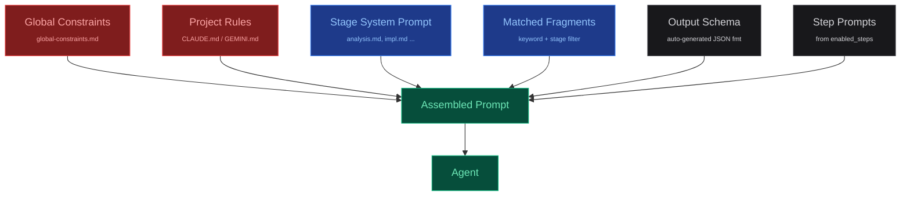

## Prompt System

The agent's final system prompt is assembled from multiple layers.
This modular design lets you share constraints across pipelines, inject
domain knowledge dynamically, and keep stage instructions focused.

### Prompt Hierarchy



| Layer | Scope | Location | Purpose |
|---|---|---|---|
| Global Constraints | All agent stages | prompts/global-constraints.md | Behavioral rules: "Never apologize", "Always use TypeScript" |
| Project Rules | All agent stages | claude-md/global.md | Repo conventions: "Use pnpm", "Follow existing patterns" |
| Stage Prompt | One stage | prompts/system/{stage}.md | Stage-specific goals and instructions |
| Fragments | Matched stages | prompts/fragments/*.md | Domain knowledge, dynamically matched |
| Output Schema | One stage | Generated from outputs config | JSON format instructions for structured output |
| Step Prompts | Dynamic | Inline in available_steps | Conditional instructions based on enabled capabilities |

### Knowledge Fragments

Fragments are reusable Markdown files with YAML frontmatter that describe
when and where to inject them:

```markdown
<!-- config/prompts/fragments/react-patterns.md -->
---
id: react-patterns
keywords: [react, component, hook, state]
stages: [implementing, reviewing]
always: false
priority: 10
---

## React Patterns for This Project

- Use functional components with arrow functions
- Prefer composition over inheritance
- Custom hooks must start with "use" prefix
- State shared across routes goes in context, not props
```

> **Stage matching**
> `stages: [implementing]` — only injected during that stage.
> Use `stages: "*"` for all stages.

> **Keyword matching**
> For stages with `available_steps`, the engine matches fragment
> keywords against selected steps. Only relevant knowledge loads.

### Context Tiers

> **Tier 1 — Injected (~500 tokens)**
> Compact summary from the stage's `reads`: task ID, description,
> branch, worktree path, selected store values. Goes directly into the prompt.

> **Tier 2 — On-demand (unlimited)**
> Full store data written to `.workflow/` files in the worktree.
> Agent reads them when needed — pays token cost only if accessed.
