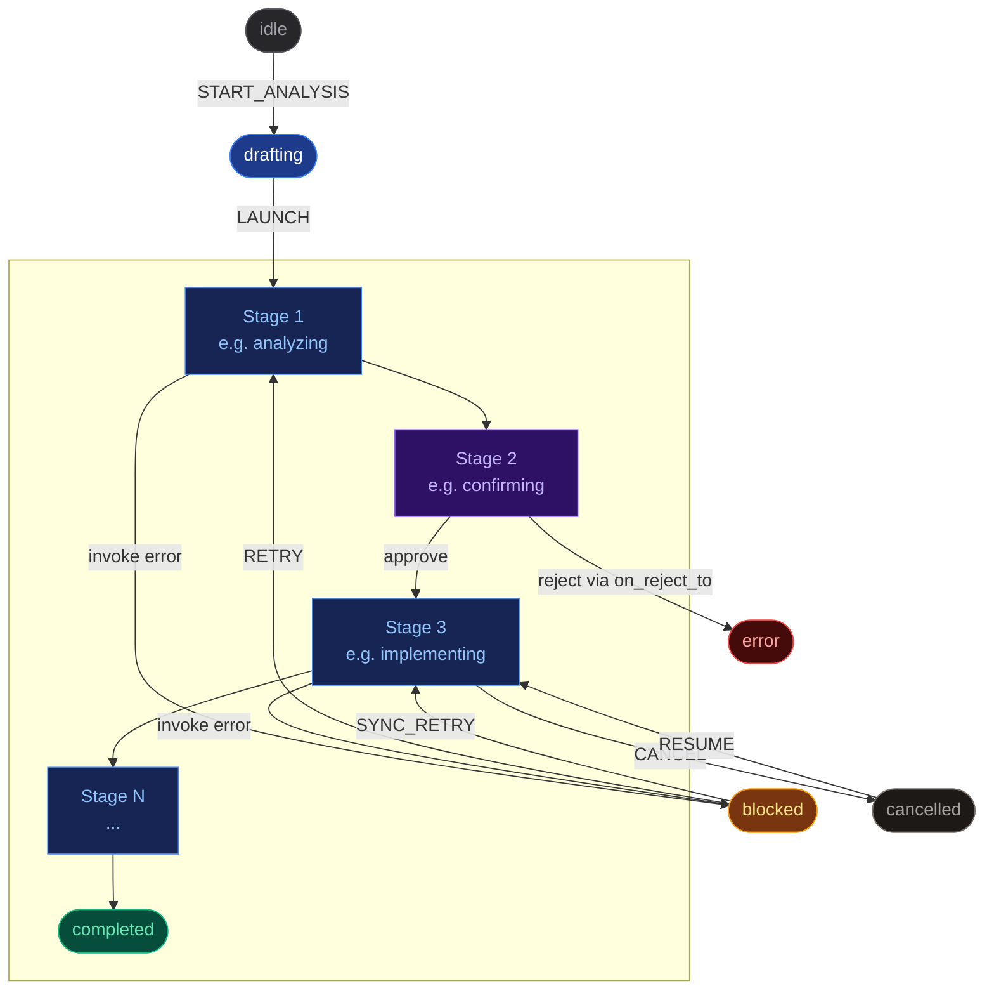

## Tasks

A task is a single execution of a pipeline against a specific piece of work.
It carries its own snapshot of pipeline config, its own data store, and its
own SSE message history.

### Creating a Task

> **Create a task**
> Type a description directly in the dashboard or pass via
> `--trigger` flag in the Edge Runner.

> **From Edge CLI**
> `pnpm edge -- --trigger "..." --pipeline name`
> creates and launches a task from the terminal.

### Lifecycle & States



| State | Meaning | What you can do |
|---|---|---|
| idle | Created but not started | Launch to begin execution |
| Running stage | An agent, script, or gate is active | Monitor, interrupt, or cancel |
| blocked | An agent stage errored | Inspect error, fix, retry or sync-retry |
| cancelled | You cancelled execution | Resume from last active stage |
| completed | All stages succeeded | Review results in Summary tab |
| error | Unrecoverable failure or rejection | Start a new task |

The key design: `blocked` and `cancelled` are both recoverable.
Accumulated store data is preserved — the task re-enters the pipeline
at the appropriate stage without losing prior work.

### Example: frontend feature from description to PR

```
# execution trace (pipeline-generator pipeline)
1. idle         -> Create task from text description, select pipeline
2. analyzing    -> AI reads the task description, produces structured analysis
3. confirming   -> You review the analysis — approve or reject with feedback
4. branching    -> Script creates git branch
5. worktree     -> Script creates isolated worktree
6. implementing -> AI writes code in the worktree
   +- blocked   -> Build failed — agent couldn't resolve an error
   +- retry     -> You click retry, agent gets the error context and fixes it
7. reviewing    -> AI self-reviews the implementation against the spec
8. pr_creation  -> Script creates GitHub PR
9. completed    -> Done. PR link available in store
```

### Real-time Monitoring

The task detail page has three tabs:

> **Workflow**
> Live message stream — agent text, tool calls with I/O, thinking blocks.
> Stage timeline at top shows progress. Filter by category, stage, or keyword.

> **Summary**
> Task data store rendered by each stage's output schema.
> Markdown fields, links, badges, code blocks — driven by `display_hint`.

> **Agent Config**
> The snapshotted pipeline config. "Interrupt unlock" mode lets you
> edit a running task's config — adjust prompts or budgets mid-execution.

### Human Interaction Points

| Interaction | When | How it works |
|---|---|---|
| Confirmation Gate | Pipeline hits a human_confirm stage | Approve, reject, or send feedback. Available in both dashboard and edge terminal. |
| Agent Question | Agent encounters ambiguity | Question panel with the agent's question. Your answer feeds back into context. |
| Interrupt Message | Anytime during agent execution | Send a message to redirect the agent. In edge mode: Ctrl+\ then 'm'. |
| Retry / Sync Retry | Task in blocked state | Re-runs the failed stage. Sync Retry: agent checks manual changes first. |
| Cancel & Resume | Anytime | Cancel preserves state. Resume re-enters at last active stage. |

> **Tip:** **Sync Retry** enables human-in-the-loop fixing.
> If the agent's output is 90% correct, manually fix the remaining issues,
> then sync-retry — the agent inspects your changes and generates its final
> output based on the current file state.
