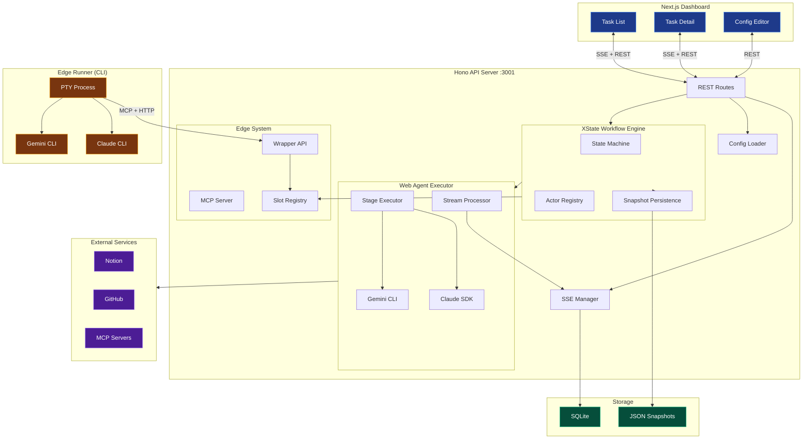
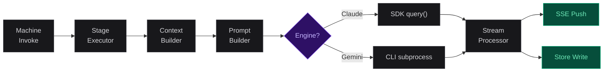

## 架构

一个包含三个包的 monorepo：Hono API 服务器（引擎）、Next.js
仪表盘（界面）和共享类型包（契约）。

### 系统拓扑



> **服务器 (apps/server)**
> Hono 框架运行在端口 3001。XState v5 状态机作为工作流内核。
> Claude Agent SDK + Gemini CLI 作为执行后端。
> SQLite 存储 SSE 历史，JSON 文件存储任务快照。

> **仪表盘 (apps/web)**
> Next.js + React。SSE 驱动的实时流，支持虚拟滚动。
> 配置编辑器用于管理流水线、提示词和系统设置。

> **共享包 (packages/shared)**
> TypeScript 类型定义：Task、SSEMessage 事件类型、
> API 请求/响应契约。两个包共同使用。

> **Edge Runner**
> 独立 CLI，通过 PTY 启动 Claude/Gemini。通过
> HTTP + MCP 与服务器通信。转录同步保持仪表盘更新。

### 状态机内部实现

状态图不是手写的。`pipeline-builder.ts` 读取流水线 YAML
并动态生成 XState 状态：

```
# dynamic state generation
pipeline.stages[]
  -> buildPipelineStates()
    -> For each entry:
        PipelineStageConfig:
          "agent"         -> XState invoke state calling runAgent()
          "script"        -> XState invoke state calling runScript()
          "human_confirm" -> Wait state listening for CONFIRM / REJECT
          "condition"     -> XState always (eventless) transitions with expr-eval guards
          "pipeline"      -> XState invoke state calling runPipelineCall()
          "foreach"       -> XState invoke state calling runForeach()
        ParallelGroupConfig:
          -> XState parallel state (type: "parallel")
          -> Each child stage becomes an independent region
          -> All regions run concurrently; group completes when all finish
          -> Skip-if-done guards for retry recovery (parallelDone tracking)
    -> Wire transitions: entry[n] -> entry[n+1], last -> "completed"
    -> Apply routing overrides: on_reject_to, on_approve_to, retry.back_to
    -> Validate: no writes overlap in groups, no external back_to, no nested parallel
```

### Agent 执行流水线（Web 模式）



> **Context Builder**
> 从阶段的 `reads` 配置构建 Tier 1 上下文（约 500 tokens）。
> 包含任务 ID、描述、分支路径和选定的 store 值。

> **Prompt Builder**
> 从 6 个层级组装最终提示词：全局约束、项目规则、
> 阶段提示词、匹配的知识片段、输出 schema、步骤提示词。

> **Stream Processor**
> 遍历 Agent 消息，推送到 SSE，处理中断-恢复
> （最多 3 层），强制 5 分钟不活动超时。

### Edge 执行流水线

在 Edge 模式下，服务器不运行 Agent。而是：

```
# edge execution flow
1. State machine marks stage as "edge slot" (pending execution)
2. Edge Runner polls GET /api/edge/:taskId/next-stage
3. Server returns stage name + config (model, effort, etc.)
4. Runner spawns Claude/Gemini CLI with:
   - MCP config pointing to server's MCP endpoint
   - Stage options as CLI flags (--model, --effort, etc.)
   - Hooks settings for interrupt checking
5. Agent calls MCP tools:
   - get_stage_context -> receives system prompt + tier 1 context
   - report_progress -> streamed to dashboard via SSE
   - submit_stage_result -> writes output to store, advances pipeline
6. Runner syncs transcript (JSONL) back to server for dashboard display
```

### 持久化与恢复

| 层级 | 存储方式 | 内容 | 用途 |
|---|---|---|---|
| 任务快照 | data_dir/tasks/ 中的 JSON | 完整的 WorkflowContext + 版本号 | 重启时恢复状态机 |
| SSE 历史 | SQLite sse_messages 表 | 所有 SSE 事件 | 为新连接重放 |

```
# server restart recovery
1. Scan data_dir/tasks/*.json
2. For each non-terminal task -> restoreWorkflow()
3. Rebuild XState actor from saved state
4. "invoke" states -> downgrade to "blocked" (safe: no auto-reexecution)
5. Terminal tasks -> auto-cleanup from memory after 5 min
```

### 实时通信 (SSE)

| 端点 | 用途 | 限制 |
|---|---|---|
| GET /api/stream/:taskId | 单个任务事件 | 10 个并发连接，30 秒心跳，历史重放 |
| GET /api/stream/tasks | 全局任务列表变更 | 100 个并发连接 |

### 配置文件布局

```
# directory structure
config/
  pipelines/{name}/
    pipeline.yaml                # Pipeline definition
    prompts/
      system/{stage}.md          # Per-stage system prompts
      global-constraints.md      # Global behavioral constraints
  mcps/registry.yaml             # MCP server definitions
  prompts/fragments/*.md         # Reusable knowledge snippets
  claude-md/global.md            # Claude project rules
  gemini-md/global.md            # Gemini project rules
  edge-hooks.json                # Hook template for edge runner

~/.config/workflow-control/
  system-settings.yaml           # Paths, keys, defaults
```
