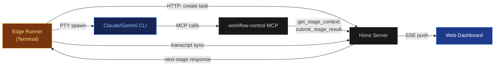

## Edge Runner

Edge Runner 在你的终端本地执行流水线阶段。
它通过 PTY 启动 Claude 或 Gemini CLI 进程，让你可以直接与 Agent 交互，
同时由服务器编排流水线。

### 工作原理



Runner 向服务器轮询下一个阶段，启动对应的 CLI 进程并通过 MCP 连接回服务器，
Agent 使用 MCP 工具（`get_stage_context`、`submit_stage_result`）
接收指令并报告结果。转录事件会同步回服务器，以保持仪表盘的实时更新。

### 用法

```bash
# trigger a new task

# Basic
pnpm edge -- --trigger "Add dark mode toggle" --pipeline pipeline-generator

# With Gemini engine
pnpm edge -- --trigger "Refactor auth module" --pipeline gemini-refactor --engine gemini

# Custom server URL
pnpm edge -- --trigger "Fix login bug" --pipeline claude-bugfix --server http://localhost:3001
```

```bash
# attach to existing task

# Resume a task by ID
pnpm edge -- <task-id>

# Paused tasks auto-resume on attach
```

### 命令模式

在 Agent 执行期间按 `Ctrl+\` 进入命令模式：

| 按键 | 操作 |
|---|---|
| c | 取消任务（等同于 Ctrl+C） |
| p | 暂停并退出——保留任务状态，稍后重新接入 |
| m | 向 Agent 发送消息（中断并输入） |
| q | 返回 Agent |

### 审批与提问处理

当流水线到达 `human_confirm` 审批节点或 Agent 提出问题时，
Runner 会切换到交互式提示模式：

> **审批**
> 选项：`a`（批准）、`r`（拒绝并附上原因）、
> `f`（反馈）。审批也可以从仪表盘操作——
> Runner 会轮询并检测外部操作。

> **提问**
> 显示 Agent 的问题。输入回答后按 Enter。
> 问题也可以从仪表盘回答。

### Edge 模式的流水线选项

服务器将阶段配置发送给 Runner。支持的选项会作为 CLI 参数
传递给 Claude/Gemini：

| 选项 | Claude CLI | Gemini CLI |
|---|---|---|
| model | --model (haiku, sonnet, opus, 或完整名称) | --model |
| effort | --effort (low, medium, high, max) | 不支持 |
| permission_mode | --permission-mode / --dangerously-skip-permissions | --approval-mode |
| debug | --debug | --debug |
| disallowed_tools | --disallowed-tools | 不支持（使用 Policy Engine） |
| agents | --agents \<json\> | 不支持 |

> **重要：** `max_turns`、`max_budget_usd` 和 `thinking` 在交互模式下不被任何 CLI 支持。
> 这些选项在 Edge 模式下会被静默忽略，并在阶段开始时打印警告。

### 模型验证

如果配置的模型名称不在已知模型列表中，Runner 会提示你选择。
按 Enter 使用配置的值，或输入其他模型名称。

### Web 与 Edge：何时使用哪种模式

| 场景 | 推荐模式 |
|---|---|
| 无人值守执行，团队可视化 | Web 模式 |
| 调试流水线或提示词 | Edge 模式 |
| 交互式编码会话 | Edge 模式 |
| 长时间运行的过夜任务 | Web 模式 |
| 测试新的流水线配置 | Edge 模式 |
| CI/CD 集成 | Web 模式（API） |
