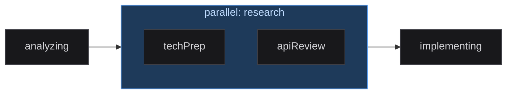

## 流水线

流水线是一个 YAML 文件，定义了执行蓝图：运行哪些阶段、
以什么顺序、使用什么参数、数据如何在阶段间流转。

> **注意：** 系统内置多个流水线，按引擎（Claude / Gemini）
> 和用途（Normal、Text、Bugfix、Refactor）分类，另有轻量级 Test 流水线用于验证。
> 以下以 `pipeline-generator` 作为参考示例。

### 结构

```yaml
# config/pipelines/pipeline-generator/pipeline.yaml (simplified)
name: "Claude Normal — Large Frontend Projects"
description: "Full-stack frontend pipeline using Claude SDK"
engine: claude

display:
  title_path: analysis.title
  completion_summary_path: prUrl

hooks: [format-on-write, safety-guard, protect-files]
skills: [security-review, performance-audit]

claude_md:
  global: global.md

stages:
  - name: analyzing
    type: agent
    model: claude-sonnet-4-6
    effort: high
    mcps: [notion, context7]
    runtime:
      engine: llm
      system_prompt: analysis
      writes: [analysis]
    outputs:
      analysis:
        fields:
          - { key: title, type: string, description: Task title }
          - { key: plan,  type: markdown, description: Implementation plan }

  - name: awaitingConfirm
    type: human_confirm
    runtime:
      engine: human_gate
      on_reject_to: analyzing
      max_feedback_loops: 3

  - name: branching
    type: script
    runtime:
      engine: script
      script_id: create_branch
      reads: { branchName: analysis.branchName }
      writes: [branch]

  - name: implementing
    type: agent
    model: claude-sonnet-4-6
    effort: high
    runtime:
      engine: llm
      system_prompt: implementation
      writes: [impl]
      reads: { plan: analysis.plan }
      agents:
        file-implementer:
          description: Implements a single file
          model: sonnet

  - name: pr_creation
    type: script
    runtime:
      engine: script
      script_id: pr_creation
      reads: { title: analysis.title, branch: branch }
```

### 阶段类型

> **AI Agent**
> type: agent / engine: llm
>
> 使用系统提示词调用 Claude 或 Gemini。
> - `system_prompt` — 提示词文件引用
> - `writes` / `reads` — 数据流
> - `model`, `effort`, `permission_mode`
> - `mcps` — 启用的 MCP 服务器
> - `agents` — 子 Agent 定义
> - `outputs` — 结构化输出 schema
> - `max_turns`, `max_budget_usd` — 限制（仅 Web 模式）
> - `thinking` — 扩展推理（仅 Web 模式）

> **脚本**
> type: script / engine: script
>
> 运行注册的自动化处理器。确定性且执行迅速。
> - `script_id` — 注册的脚本名称
> - `reads` — 映射到输入的 store 路径
> - `writes` — 写回 store 的返回字段
> - `args` — 静态参数
> - `timeout_sec` — 执行超时

> **人工审批**
> type: human_confirm / engine: human_gate
>
> 暂停流水线等待人工审核。
> - `on_reject_to` — 拒绝后跳转到哪个阶段
> - `on_approve_to` — 批准后跳转到哪个阶段
> - `max_feedback_loops` — 拒绝次数上限，超过则报错
> - `notify` — Slack 通知

> **条件路由**
> type: condition / engine: condition
>
> 求值表达式分支，跳转到第一个匹配的目标。
> 使用 `expr-eval` 安全求值（无 `eval`）。
> - `branches` — `{ when, to }` 对象数组；其中恰好有一个 `default: true`
> - 表达式通过 `store.xxx` 访问 store，例如 `store.score > 80`
> - 支持 `and`、`or`、`==`、`!=`、`>`、`<`、`>=`、`<=` 运算符

> **子流水线调用**
> type: pipeline / engine: pipeline
>
> 将另一个流水线作为子任务调用，等待其完成。
> 子流水线继承父任务的 worktree 和 branch。
> - `pipeline_name` — 要调用的流水线 ID
> - `reads` — 将父 store 路径映射到子流水线初始 store 的 key
> - `writes` — 从子 store 提取回父 store 的字段
> - `timeout_sec` — 最大等待时间（默认 300 秒）

> **遍历**
> type: foreach / engine: foreach
>
> 遍历 store 中的数组，对每个元素运行一个子流水线。
> 内部依赖 Pipeline Call 机制。
> - `items` — store 中数组的路径（例如 `store.pr_list`）
> - `item_var` — 当前元素在每个子流水线 store 中的 key 名
> - `pipeline_name` — 每个元素要运行的流水线
> - `max_concurrency` — 并发数限制（默认 1 = 串行）
> - `collect_to` — 收集结果数组的 store key
> - `item_writes` — 从每个子流水线提取的字段
> - `on_item_error` — `"fail_fast"`（默认）或 `"continue"`
> - `isolation` — `"shared"`（默认）或 `"worktree"`。设为 `"worktree"` 时，每个元素
>   获得独立的 git worktree 和分支，避免 `max_concurrency > 1` 时的文件冲突。
>   所有元素完成后，worktree 目录被清理但分支保留。
>   收集结果中包含每个元素的 `__branch`。需要在后续添加一个 agent 阶段来合并/集成分支。
> - `auto_commit` — 成功后自动提交元素的更改（isolation 为 worktree 时默认 `true`）

### 并行组（并发执行）

将多个阶段包裹在 `parallel` 块中即可并发执行。
所有子阶段同时启动；当**所有**子阶段完成后，整个组才完成。

```yaml
stages:
  - name: analyzing
    type: agent
    runtime:
      engine: llm
      system_prompt: analysis
      writes: [analysis]

  - parallel:
      name: research
      stages:
        - name: techPrep
          type: agent
          runtime:
            engine: llm
            system_prompt: tech_research
            writes: [techContext]
            reads: { plan: analysis.plan }
        - name: apiReview
          type: agent
          runtime:
            engine: llm
            system_prompt: api_audit
            writes: [apiAudit]
            reads: { plan: analysis.plan }

  - name: implementing
    type: agent
    runtime:
      engine: llm
      system_prompt: implementation
      writes: [impl]
      reads: { tech: techContext, api: apiAudit }
```

**规则：**

| 规则 | 原因 |
|---|---|
| 子阶段的 `writes` key 不能重叠 | 并发写入同一 key 会导致数据竞争 |
| 子阶段不能 `reads` 兄弟阶段的输出 | 兄弟输出在组完成前不可用 |
| `retry.back_to` 只能引用同组内的兄弟阶段 | XState 并行区域无法跳转到外部状态 |
| 组内不允许 `human_confirm` 阶段 | 审批门控需要独占流水线控制权 |
| 并行组不能嵌套 | 不支持并行内再嵌并行 |

**数据流：** 组完成后，所有子阶段的输出合并到 store 中。
下游阶段可以正常读取任意子阶段的 writes。

**重试与恢复：** 如果子阶段失败并耗尽重试次数，整个组进入 `blocked`。
RETRY 时，已完成的兄弟阶段会被跳过（通过 `parallelDone` 上下文跟踪），
只有失败的子阶段重新运行。



### 阶段配置选项

| 选项 | Web 模式 | Edge 模式 (Claude) | Edge 模式 (Gemini) |
|---|---|---|---|
| model | SDK model | --model | --model |
| effort | SDK effort | --effort | 不支持 |
| permission_mode | SDK permissionMode | --permission-mode | --approval-mode |
| debug | SDK debug | --debug | --debug |
| disallowed_tools | SDK disallowedTools | --disallowed-tools | 不支持 |
| agents (sub-agents) | SDK agents | --agents \<json\> | 不支持 |
| max_turns | SDK maxTurns | 不支持 | 不支持 |
| max_budget_usd | SDK maxBudgetUsd | 不支持 | 不支持 |
| thinking | SDK thinking | 不支持 | 不支持 |

> **重要：** Edge 模式下标记为"不支持"的选项会被静默忽略。
> Runner 会在每个阶段开始时打印警告，列出被跳过的选项。

### 数据流

阶段通过中心化的 `store` 交换数据。阶段不会直接访问
store，而是声明它们要读取和写入的内容：

```mermaid
flowchart LR
  subgraph analyzing ["Stage: analyzing"]
    A_Agent["AI Agent"] --> A_Out["Output JSON"]
    A_Out -->|"writes: [analysis]"| Store_A["store.analysis"]
  end

  subgraph implementing ["Stage: implementing"]
    Store_A -->|"reads: {plan: analysis.plan}"| B_Ctx["Tier 1 Context"]
    B_Ctx --> B_Agent["AI Agent"]
    B_Agent --> B_Out["Output JSON"]
    B_Out -->|"writes: [impl]"| Store_B["store.impl"]
  end

  subgraph pr ["Stage: pr_creation"]
    Store_A -->|"reads: {title: analysis.title}"| C_In["Script Inputs"]
    Store_B -->|"reads: {branch: impl.branch}"| C_In
    C_In --> C_Script["Script"]
    C_Script -->|"writes: [pr]"| Store_C["store.pr"]
  end

  classDef store fill:#1e3a8a,stroke:#3b82f6,color:#93c5fd
  classDef agent fill:#064e3b,stroke:#10b981,color:#6ee7b7
  classDef default fill:#18181b,stroke:#3f3f46,color:#d4d4d8
  class Store_A,Store_B,Store_C store
  class A_Agent,B_Agent,C_Script agent
```



> **writes**
> Agent 返回 JSON。引擎提取 `writes` 中列出的字段并保存到
> `store[field]`。脚本的返回值也通过 `writes` 过滤。

> **reads**
> 从输入名称到 store 路径的映射：`{plan: "analysis.plan"}`。
> 对于 Agent：作为 Tier 1 上下文。对于脚本：作为 `inputs` 参数。

> **outputs schema**
> 定义预期的输出结构。自动在提示词中生成 JSON 格式指令，
> 并告知仪表盘如何渲染数据（通过 `display_hint`）。

**并行组数据流：** 子阶段从上游读取数据，独立写入各自的 key，
组完成后所有输出合并到 store。

```mermaid
flowchart LR
  subgraph analyzing ["Stage: analyzing"]
    A_Agent["AI Agent"] --> A_Out["Output JSON"]
    A_Out -->|"writes: [analysis]"| Store_A["store.analysis"]
  end

  subgraph PG ["parallel: research"]
    direction TB
    subgraph techPrep ["techPrep"]
      Store_A -.->|"reads: {plan: analysis.plan}"| T_Ctx["Context"]
      T_Ctx --> T_Agent["AI Agent"]
      T_Agent -->|"writes: [techContext]"| Store_T["store.techContext"]
    end
    subgraph apiReview ["apiReview"]
      Store_A -.->|"reads: {plan: analysis.plan}"| R_Ctx["Context"]
      R_Ctx --> R_Agent["AI Agent"]
      R_Agent -->|"writes: [apiAudit]"| Store_R["store.apiAudit"]
    end
  end

  subgraph implementing ["Stage: implementing"]
    Store_T -->|"reads: {tech: techContext}"| I_Ctx["Context"]
    Store_R -->|"reads: {api: apiAudit}"| I_Ctx
    I_Ctx --> I_Agent["AI Agent"]
    I_Agent -->|"writes: [impl]"| Store_I["store.impl"]
  end

  classDef store fill:#1e3a8a,stroke:#3b82f6,color:#93c5fd
  classDef agent fill:#064e3b,stroke:#10b981,color:#6ee7b7
  classDef parallel fill:#1e3a5a,stroke:#60a5fa,color:#bfdbfe
  classDef default fill:#18181b,stroke:#3f3f46,color:#d4d4d8
  class Store_A,Store_T,Store_R,Store_I store
  class A_Agent,T_Agent,R_Agent,I_Agent agent
  class PG parallel
```



### 路由与分支

| 配置字段 | 行为 | 示例 |
|---|---|---|
| on_reject_to | 人工拒绝时跳转到指定阶段 | 审核员拒绝 -> 返回 implementing |
| on_approve_to | 批准时跳过到指定阶段 | 快速通道 -> 跳过 review，直达 PR |
| retry.back_to | 重试时跳转到指定阶段而非当前阶段 | QA 失败 -> 从 implementing 重试 |

### 内置脚本库

| Script ID | 用途 |
|---|---|
| create_branch | 根据分析输出创建 git 分支 |
| git_worktree | 为实现阶段创建隔离的 git worktree |
| notion_sync | 将任务状态标签同步到 Notion 页面 |
| pr_creation | 通过 gh CLI 创建 GitHub Pull Request |
| build_gate | 运行构建/测试验证作为质量关卡 |

### AI 流水线生成

配置页面提供 **AI Generate** 按钮，可以从自然语言描述生成完整的流水线。
选择引擎（auto / claude / gemini），描述你的工作流，系统会生成包含正确阶段定义、
数据流和输出 schema 的有效 YAML。

生成器调用本地 CLI（`claude -p` 或 `gemini`）作为子进程 —
无需额外 API 密钥。生成的流水线在创建前会通过 Zod schema 验证。
每个 Agent 阶段的提示词占位文件会自动创建。

生成的流水线中引用的自定义脚本会自动写入 `config/scripts/`。
