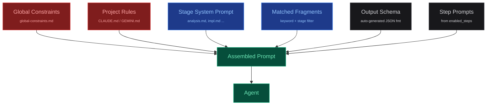

## 提示词系统

Agent 的最终系统提示词由多个层级组装而成。
这种模块化设计让你可以在流水线间共享约束条件、
动态注入领域知识，并保持阶段指令的专注性。

### 提示词层级



| 层级 | 作用范围 | 位置 | 用途 |
|---|---|---|---|
| Global Constraints | 所有 Agent 阶段 | prompts/global-constraints.md | 行为规则："Never apologize"、"Always use TypeScript" |
| Project Rules | 所有 Agent 阶段 | claude-md/global.md | 仓库规范："Use pnpm"、"Follow existing patterns" |
| Stage Prompt | 单个阶段 | prompts/system/{stage}.md | 阶段特定的目标和指令 |
| Fragments | 匹配的阶段 | prompts/fragments/*.md | 领域知识，动态匹配 |
| Output Schema | 单个阶段 | 从 outputs 配置生成 | 结构化输出的 JSON 格式指令 |
| Step Prompts | 动态 | 内联在 available_steps 中 | 基于启用功能的条件性指令 |

### 知识片段

知识片段是带有 YAML frontmatter 的可复用 Markdown 文件，
frontmatter 描述了何时何处注入它们：

```markdown
<!-- config/prompts/fragments/react-patterns.md -->
---
id: react-patterns
keywords: [react, component, hook, state]
stages: [implementing, reviewing]
always: false
priority: 10
---

## React Patterns for This Project

- Use functional components with arrow functions
- Prefer composition over inheritance
- Custom hooks must start with "use" prefix
- State shared across routes goes in context, not props
```

> **阶段匹配**
> `stages: [implementing]` — 仅在该阶段注入。
> 使用 `stages: "*"` 可在所有阶段注入。

> **关键词匹配**
> 对于包含 `available_steps` 的阶段，引擎会将片段关键词
> 与选定步骤进行匹配。只加载相关的知识内容。

### 上下文层级

> **Tier 1 — 注入型（约 500 tokens）**
> 从阶段的 `reads` 提取的紧凑摘要：任务 ID、描述、
> 分支、worktree 路径、选定的 store 值。直接注入提示词中。

> **Tier 2 — 按需型（无限制）**
> 完整的 store 数据写入 worktree 中的 `.workflow/` 文件。
> Agent 需要时才读取——仅在访问时消耗 token。
