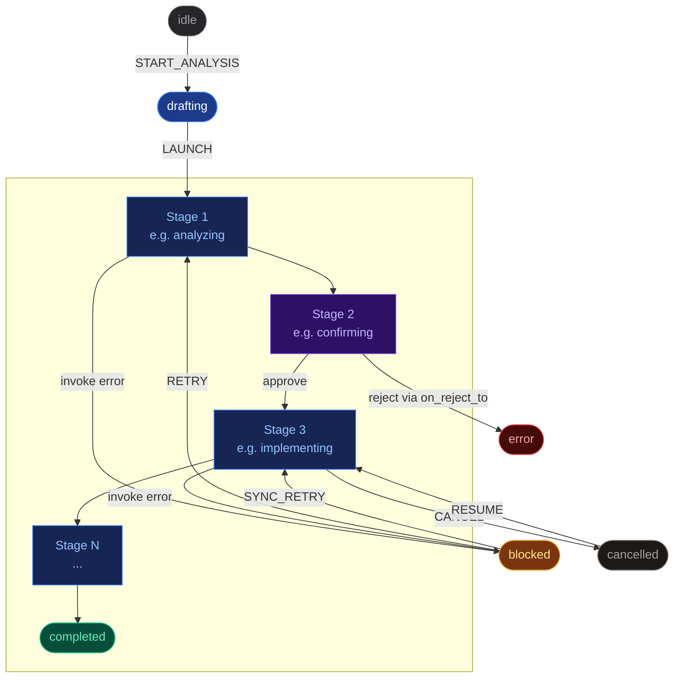

## 任务

任务是针对特定工作执行一次流水线的实例。
它拥有独立的流水线配置快照、独立的数据 store，以及独立的 SSE 消息历史。

### 创建任务

> **创建任务**
> 在仪表盘中直接输入描述，或通过 Edge Runner 的
> `--trigger` 参数传入。

> **从 Edge CLI 创建**
> `pnpm edge -- --trigger "..." --pipeline name`
> 从终端创建并启动任务。

### 生命周期与状态



| 状态 | 含义 | 可执行操作 |
|---|---|---|
| idle | 已创建但未启动 | 启动以开始执行 |
| Running stage | Agent、脚本或人工审批正在执行中 | 监控、中断或取消 |
| blocked | Agent 阶段发生错误 | 检查错误、修复、retry 或 sync-retry |
| cancelled | 你取消了执行 | 从上一个活动阶段恢复 |
| completed | 所有阶段执行成功 | 在 Summary 标签页查看结果 |
| error | 不可恢复的失败或被拒绝 | 创建新任务 |

核心设计：`blocked` 和 `cancelled` 都是可恢复的。
已积累的 store 数据会被保留——任务会在适当的阶段重新进入流水线，
不会丢失之前的工作成果。

### 示例：从任务描述到 PR 的前端功能开发

```
# execution trace (pipeline-generator pipeline)
1. idle         -> Create task from text description, select pipeline
2. analyzing    -> AI reads the task description, produces structured analysis
3. confirming   -> You review the analysis — approve or reject with feedback
4. branching    -> Script creates git branch
5. worktree     -> Script creates isolated worktree
6. implementing -> AI writes code in the worktree
   +- blocked   -> Build failed — agent couldn't resolve an error
   +- retry     -> You click retry, agent gets the error context and fixes it
7. reviewing    -> AI self-reviews the implementation against the spec
8. pr_creation  -> Script creates GitHub PR
9. completed    -> Done. PR link available in store
```

### 实时监控

任务详情页有三个标签页：

> **Workflow**
> 实时消息流——Agent 文本、工具调用（含输入/输出）、思考过程。
> 顶部的阶段时间线显示进度。支持按类别、阶段或关键词过滤。

> **Summary**
> 按每个阶段的输出 schema 渲染任务数据 store。
> Markdown 字段、链接、徽章、代码块——由 `display_hint` 驱动。

> **Agent Config**
> 快照化的流水线配置。"Interrupt unlock" 模式允许你
> 编辑运行中任务的配置——在执行过程中调整提示词或预算。

### 人工交互节点

| 交互类型 | 触发时机 | 工作方式 |
|---|---|---|
| 确认审批 | 流水线到达 human_confirm 阶段 | 批准、拒绝或发送反馈。仪表盘和 Edge 终端均可操作。 |
| Agent 提问 | Agent 遇到模糊之处 | 显示提问面板和 Agent 的问题。你的回答会反馈到上下文中。 |
| 中断消息 | Agent 执行期间的任意时刻 | 发送消息重新引导 Agent。Edge 模式下：Ctrl+\ 然后按 'm'。 |
| Retry / Sync Retry | 任务处于 blocked 状态 | 重新运行失败的阶段。Sync Retry：Agent 会先检查手动修改。 |
| 取消与恢复 | 任意时刻 | 取消会保留状态。恢复从上一个活动阶段重新进入。 |

> **提示：** **Sync Retry** 支持人机协作修复。
> 如果 Agent 的输出正确率达到 90%，你可以手动修复剩余问题，
> 然后执行 sync-retry——Agent 会检查你的修改，并基于当前文件状态
> 生成最终输出。
