# Workflow Control: 架构可视化

> Version 1.0 | 2026-04-17 | Companion to [`architecture-whitepaper-zh.md`](./architecture-whitepaper-zh.md)

本文是白皮书的**可视化补充**，用 Mermaid 把白皮书里的 ASCII 图和文字说明图形化，方便在 dashboard / GitHub / Notion 直接渲染。不覆盖白皮书的文字论述，只做图解与对照表。每张图下方给出"看图要点"与源码锚点，便于跳转核对。

## 目录

- [第一层：架构全景](#第一层架构全景)
  - [1.1 系统拓扑](#11-系统拓扑)
  - [2.1 组件依赖](#12-组件依赖)
  - [1.3 宿主与执行面](#13-宿主与执行面)
- [第二层：运行时机理](#第二层运行时机理)
  - [2.1 Task 生命周期状态](#21-task-生命周期状态)
  - [2.2 Stage 执行时序](#22-stage-执行时序)
  - [2.3 XState Machine 结构](#23-xstate-machine-结构)
  - [2.4 Session 管理与清理](#24-session-管理与清理)
  - [2.5 Context Tier 与 Store 数据流](#25-context-tier-与-store-数据流)
  - [2.6 Prompt 六层组装](#26-prompt-六层组装)
- [第三层：能力对照](#第三层能力对照)
  - [3.1 Stage 类型对照表](#31-stage-类型对照表)
  - [3.2 Single-Session vs Multi-Session](#32-single-session-vs-multi-session)
  - [3.3 Actor 注册表](#33-actor-注册表)
  - [3.4 SSE 事件清单](#34-sse-事件清单)
- [第四层：潜在问题提示](#第四层潜在问题提示)
- [与白皮书的章节映射](#与白皮书的章节映射)

---

## 第一层：架构全景

### 1.1 系统拓扑

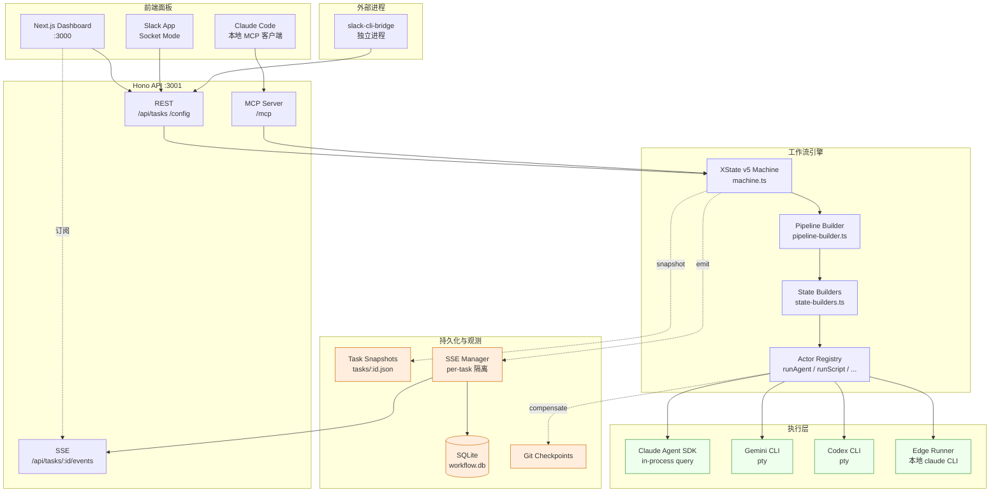

**看图要点**
- 三种触发方 (Web / Slack / Claude Code) 走同一条通道：REST 或 MCP 进入 Hono，最终驱动同一份 XState machine。
- 引擎本身与执行层解耦：machine 只管 state，actor 才调用具体 SDK / CLI。
- SSE 和 snapshot 是**旁路写**，不参与主流程决策，只做观测与恢复。
- `slack-cli-bridge` 是独立进程，**不是** server 的一部分，它通过 HTTP 调用 server。

**源码锚点**
- Hono 入口: `apps/server/src/index.ts`
- Machine 工厂: `apps/server/src/machine/machine.ts:41`
- MCP server: `apps/server/src/edge/mcp-server.ts`
- Slack bridge: `apps/slack-cli-bridge/src/index.ts`

---

### 1.2 组件依赖

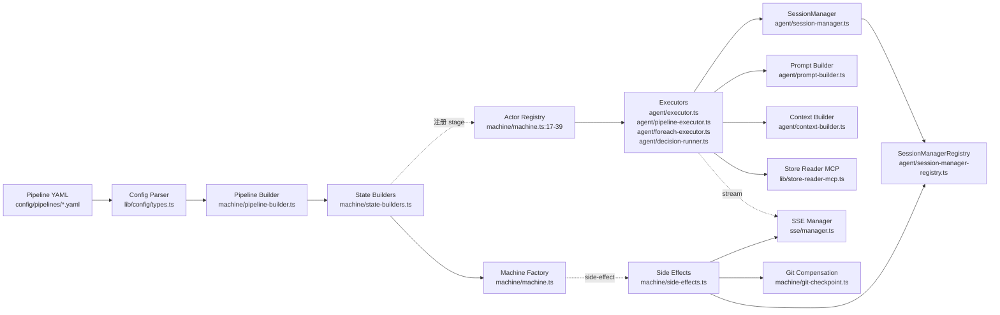

**看图要点**
- YAML → parser → builder → state builders → machine 是**纯构建链**，不涉及执行。
- Executors 与 prompt/context/MCP 并列，各司其职；SessionManager 被 agent executor 使用，但由 registry 集中管理。
- Side effects 是 XState `emit` 的消费者，**不直接被 state 引用**，解耦策略让重试/恢复不会重复触发副作用（除非显式设计）。

---

### 1.3 宿主与执行面

Workflow control 有三种真实的执行形态，容易混淆，这里用一张图澄清。

```mermaid
flowchart TB
  subgraph Local[本地执行模式 默认]
    direction LR
    L1[HTTP POST /api/tasks] --> L2[XState machine 驻留在 server 进程]
    L2 --> L3[runAgent / runAgentSingleSession<br/>直接调用 Claude SDK query]
    L3 --> L4[同进程返回结果<br/>累计 cost/token]
  end

  subgraph EdgeMode[Edge 执行模式]
    direction LR
    E1[Edge Runner<br/>本地用户机器] --> E2[pnpm edge -- --trigger ...]
    E2 --> E3[pty 启动 claude CLI]
    E3 --> E4[MCP 回连 server<br/>claim_stage / submit_result]
    E4 --> E5[server 收到结果<br/>推进 machine]
  end

  subgraph Hybrid[Slack CLI Bridge]
    direction LR
    H1[Slack 消息] --> H2[slack-cli-bridge<br/>独立进程]
    H2 --> H3[ProcessManager 启动 claude CLI]
    H3 --> H4[通过 HTTP 喂回 server]
  end

  classDef local fill:#e8f4ff
  classDef edge fill:#fff3e0
  classDef hybrid fill:#f0f0f0
  class L1,L2,L3,L4 local
  class E1,E2,E3,E4,E5 edge
  class H1,H2,H3,H4 hybrid
```

**看图要点**
- **本地模式**最高效：agent 直接在 server 进程里用 SDK query，零 IPC 开销，cost/token 统计精准。
- **Edge 模式**解决"server 不能在用户机器上执行代码"的场景：用户本地跑 claude CLI，通过 MCP 把结果回传给 server。
- **Slack CLI Bridge** 是为长会话交互场景设计的，和前两者平行存在，不是主路径。

---

## 第二层：运行时机理

### 2.1 Task 生命周期状态

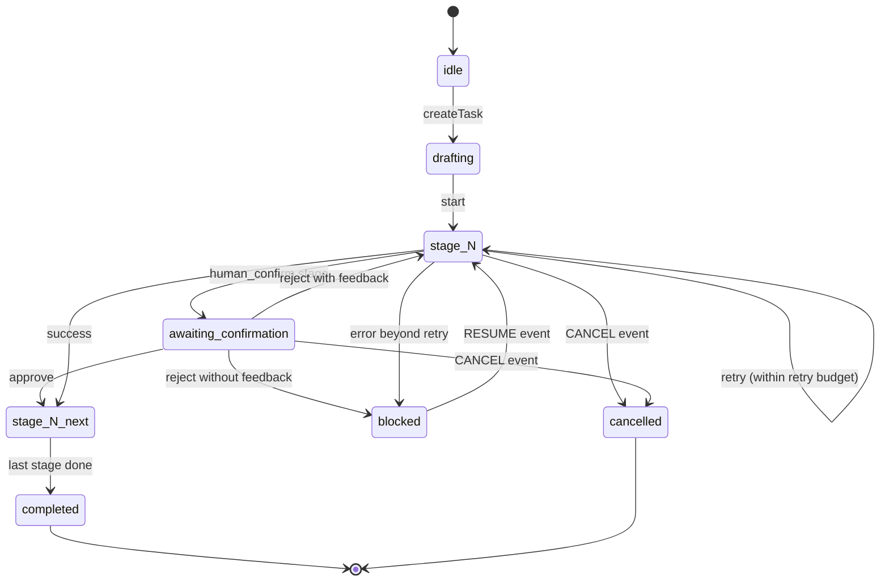

**看图要点**
- `blocked` 是可恢复状态，`cancelled` 是终止状态。
- `human_confirm` 的 reject 分两种：带 feedback 回到本 stage（将 feedback 注入下一次 agent 对话），不带 feedback 则 block 等待人工介入。
- `CANCEL` 事件从任何 state 都能进（side-effects.ts 会一并清理 session）。

**源码锚点**
- State 转移定义: `apps/server/src/machine/state-builders.ts` 各 build* 函数
- Cancel / Interrupt 全局处理: `apps/server/src/machine/machine.ts:74-100`

---

### 2.2 Stage 执行时序

以 `agent` stage 为例（multi-session 模式）：

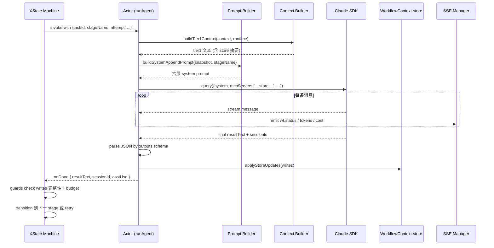

**看图要点**
- Prompt / context 构建在 actor **内部**完成，machine 不感知提示细节。
- SDK 的流式消息通过 SSE 旁路出去，**不阻塞** actor 主路径。
- `onDone` 之后才由 machine 的 guard 决定是否重试（例如 writes 缺字段）。

**源码锚点**
- Actor 入口: `apps/server/src/agent/executor.ts:55` (`runAgent`)
- Prompt 组装: `apps/server/src/agent/prompt-builder.ts:21`
- Store 更新: `apps/server/src/machine/state-builders.ts:84-99`
- Guards 示例: `state-builders.ts:1458-1466`

---

### 2.3 XState Machine 结构

Pipeline 动态编译为如下层级：

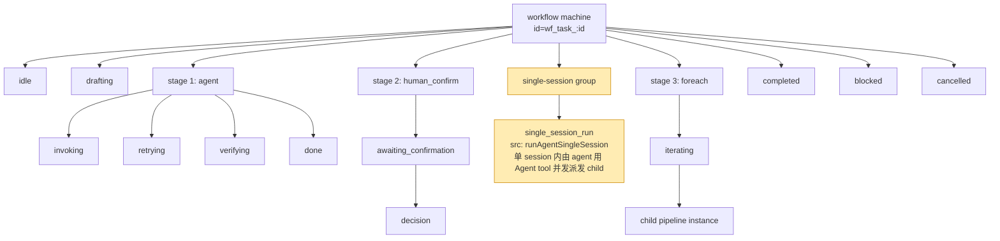

**看图要点**
- 每个 stage 在顶层是平行兄弟 state，通过 transition 串联，而不是嵌套。
- **single-session group** 是特殊节点：**整组内部不存在 XState 子 state**，所有 child 在一个 actor invoke 里顺序跑完（见 2.4）。
- `foreach` 通过 actor 内部循环实现，而不是展开成 N 个子 state。

**源码锚点**
- 编译入口: `apps/server/src/machine/pipeline-builder.ts`
- agent state 子状态: `state-builders.ts:171` (`buildAgentState`)
- single-session group: `state-builders.ts:1388` (`buildSingleSessionParallelState`)

> 📌 **语义澄清**：`buildSingleSessionParallelState` 在**单一 session 对话内**由 agent 通过 Claude SDK 的 Agent tool **并发派发**所有 child stages（见 `session-manager.ts:711-760` `executeParallelGroup`，dispatch prompt 明确写 "Launch ALL child stages simultaneously using the Agent tool"）。源码注释里的 "sequentially" 指的是**对话连续性**（同一个 conversation 线程），不是 child 执行串行。child 之间依然是真并发，只是运行在同一父 session 中。

---

### 2.4 Session 管理与清理

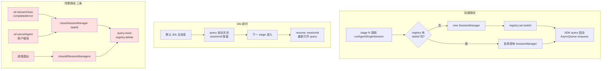

**看图要点**
- Single-session 的核心是"**一个 taskId ↔ 一个 SessionManager ↔ 一个 query**"的映射。
- 跨 stage 的对话历史靠 query 本身保留；short idle 关闭后靠 `resume: sessionId` 重建。
- **清理路径是齐全的**（三条都存在），无泄漏风险。

**源码锚点**
- SessionManager: `apps/server/src/agent/session-manager.ts:106`
- Registry: `apps/server/src/agent/session-manager-registry.ts:18`
- 清理钩子: `apps/server/src/machine/side-effects.ts:111` (完成/错误), `:179` (取消)
- 进程级清理: `apps/server/src/index.ts:173-174`

---

### 2.5 Context Tier 与 Store 数据流

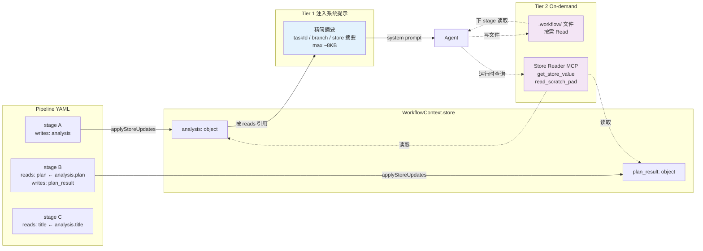

**看图要点**
- **Tier 1** 是"一次性注入"的纯文本，走 system prompt 通道，随 cache prefix 复用。
- **Tier 2** 是"按需拉取"的通道：大数据放 `.workflow/` 文件让 agent 用 Read 工具读；结构化数据走 `__store__` MCP。
- `reads` 声明哪些 store key 进 Tier 1，`writes` 声明本 stage 产出哪些 key。未声明的 store key 不会出现在 Tier 1。

**源码锚点**
- Tier 1 构建: `apps/server/src/agent/context-builder.ts:76`
- Store 写入策略: `apps/server/src/machine/state-builders.ts:84-99` (replace / append / merge)
- Store Reader MCP: `apps/server/src/lib/store-reader-mcp.ts:11`

---

### 2.6 Prompt 六层组装

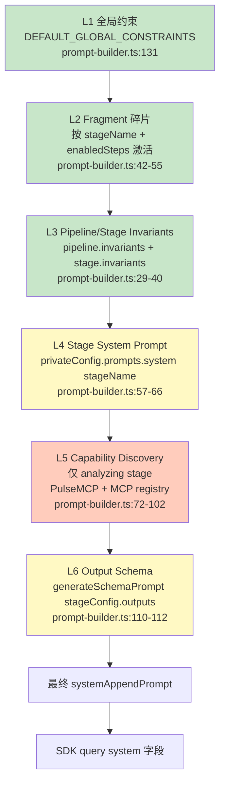

**看图要点**
- 层次从**宽到窄**：全局 → 碎片 → 管线/阶段 invariants → 阶段本身 → 阶段运行时发现 → 输出 schema。
- L1–L3 相对稳定，对 prompt cache 友好；L4–L6 按 stage 变化。
- **Fragment 激活规则**：stage 名匹配 + enabled_steps 交集 + 关键词匹配。同一 stage 多次执行，激活集合可能不同（capability discovery 影响）。

**源码锚点**
- 主函数: `apps/server/src/agent/prompt-builder.ts:21` (`buildSystemAppendPrompt`)
- 静态前缀: `:131` (`buildStaticPromptPrefix`)

---

## 第三层：能力对照

### 3.1 Stage 类型对照表

| Stage Type     | Engine          | 关键配置                                | Actor                      | 典型用途                          | 源码位置                           |
|----------------|-----------------|---------------------------------------|----------------------------|----------------------------------|-----------------------------------|
| `agent`        | `llm`           | `system_prompt`, `reads`, `writes`, `max_turns`, `budget_usd` | `runAgent` / `runAgentSingleSession` | Claude/Gemini 执行复杂推理任务 | `state-builders.ts:171`           |
| `script`       | `script`        | `command`, `inputs`, `env`            | `runScript`                | git worktree、PR、构建、确定性操作 | `state-builders.ts:690`           |
| `human_confirm`| `human_gate`    | `template`, `reject_target`           | —（由 machine 等待外部事件）| 人工审批、反馈回路                | `state-builders.ts:767`           |
| `condition`    | `condition`     | `branches[].when`                     | —（纯 guard 决策）          | 基于 store 做分支                 | `state-builders.ts:938`           |
| `llm_decision` | `llm_decision`  | `question`, `options`, `context`      | `runLlmDecision`           | 小模型快速做路由决策              | `state-builders.ts:1113`          |
| `pipeline`     | `pipeline`      | `pipeline_name`, `inputs`, `outputs`  | `runPipelineCall`          | 嵌套调用另一个 pipeline           | `state-builders.ts:1020`          |
| `foreach`      | `foreach`       | `items`, `concurrency`, `child`       | `runForeach`               | 批量处理 items（可并发）          | `state-builders.ts:1067`          |

所有 stage 共享字段：`writes` / `reads` / `retry` / `compensation` / `verify_commands` / `verify_policy` / `verify_max_retries`。详见 `apps/server/src/lib/config/types.ts:22-170`。

---

### 3.2 Single-Session vs Multi-Session

| 维度                     | Multi-Session（默认）                       | Single-Session                                        |
|--------------------------|-------------------------------------------|------------------------------------------------------|
| 触发配置                 | 不设 `session_mode` 或 `"multi"`          | `session_mode: single` + parallel group 声明         |
| Actor                    | `runAgent`                                | `runAgentSingleSession`                              |
| 每 stage 是否新开 query  | 是                                         | **否**，共享一个 query                                 |
| 对话历史                 | 不跨 stage                                 | 跨 stage 累积                                         |
| Prompt cache 复用        | 每 stage 重新 build prefix                | prefix 一次构建，后续 stage 仅追加增量                 |
| 并行执行                 | XState parallel state 级并行（每 child 独立 query） | **单 session 内** agent 用 Agent tool 并发派发 child |
| 失败重试粒度             | 单 stage 重试                              | **整组重试**（SDK resume 只能整 session 恢复；可通过 stageCheckpoints 做迂回，见 P2） |
| Idle 超时                | N/A                                       | 默认 30s，超时后 `resume: sessionId` 恢复              |
| 适用场景                 | stage 间耦合弱、想 cost 隔离、允许并发     | stage 间强依赖、需要 agent 持续上下文推理              |

**重试粒度说明**：single-session 模式下，整个 group 作为一个 XState 节点，失败时重跑整组。Claude Agent SDK 的 `resume: sessionId` 只支持"整个 session 完整恢复"，不能截断到某个 child 边界，所以**在 XState 层**无法优雅回退到单个 child。但项目里已经有 `stageCheckpoints`（`stage-executor.ts:112-120`）给单 stage 中断续跑用——这是 P2 的迂回方案基础。

---

### 3.3 Actor 注册表

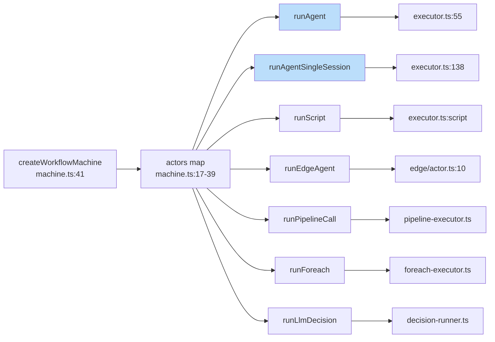

**看图要点**
- 每个 actor 都被 `loggedActor()` 包装过，用于统一日志与错误捕获（machine.ts:17）。
- `runAgent` 和 `runAgentSingleSession` 是**仅有**的两个需要 SessionManager 的 actor。

---

### 3.4 SSE 事件清单

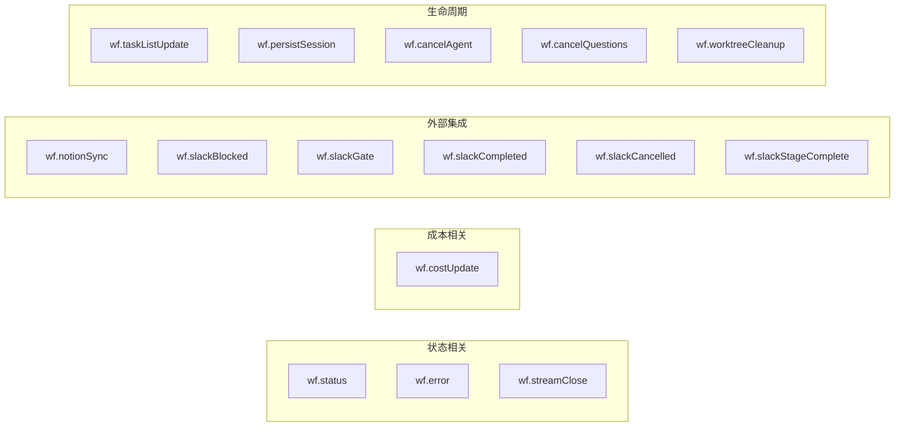

源码: `apps/server/src/machine/events.ts:3-18` + `side-effects.ts` 的 handler。

---

## 第四层：潜在问题提示

扫描源码时发现的问题，供后续演进参考。不是必须立刻修复的 bug，但值得记录。

### P1 "parallel group" 概念名与实现语义错位（**已澄清，非 bug**）

**位置**: `apps/server/src/machine/state-builders.ts:1376-1388` + `apps/server/src/agent/session-manager.ts:711-760` (`executeParallelGroup`)

**真相**: 经 `session-manager.ts:711-760` 验证，single-session 模式下 child stages **确实是并发执行的**——agent 在单一 conversation 里用 Claude SDK 的 Agent tool 并发派发所有 child。dispatch prompt 明确写 "Launch ALL child stages simultaneously using the Agent tool"（L740）。

源码注释里的 "sequentially inside one conversation" 指的是**对话会话的连续性**（不跨 session），不是 child 执行串行。

**遗留问题**（文档层面）:
- 两个"并发"层次容易混淆：
  - Multi-session：每个 child 独立 SDK query，XState 层并发
  - Single-session：一个 SDK query，agent 层用 Agent tool 并发
- XState 视角能看到的只是 "runAgentSingleSession" 一个 invoke，中途的并发 sub-task 对外层不可见（cost/token 聚合按整组粒度）

**建议**: 保持代码不改，在文档（本文 3.2 + 2.3）已明确区分两种并发语义即可。

---

### P2 整组重试：硬约束可通过 per-child checkpoint 绕过

**位置**: `state-builders.ts:1382-1386`（约束声明）+ `stage-executor.ts:112-120`（既有 checkpoint 机制）

**硬约束部分**: Claude Agent SDK 的 `resume: sessionId` 只能**整个 session 完整恢复**，无法截断到某个 child 边界（见 `session-manager.ts:302-309`）。所以从 **XState 层**看，group 整组重试是硬约束——不能把整组 state 回退到"只重跑第 3 个 child"。

**可绕过部分**（迂回方案）:
项目**已有** `stageCheckpoints` 机制（`stage-executor.ts:112-120`），用于单 stage 中断恢复：

```ts
const checkpoint = context.stageCheckpoints?.[stageName];
// 若有 checkpoint → 在下次 prompt 里注入 "Previous Progress (from interrupted execution)"
```

把这个机制扩展到 single-session group 内部：

| 步骤 | 实现点 | 成本估计 |
|------|--------|---------|
| 1. `executeParallelGroup` 里每个 child Agent 调用完成后，把其产出的 writes 单独存到 `stageCheckpoints[groupName].children[childName]` | `session-manager.ts:711-760` | 小 |
| 2. Group 失败重跑时，构造 dispatch prompt 时**排除已完成的 child**（改写 prompt 里的 "## Child Stages" 只列未完成的） | 同文件，dispatch prompt 构造段 | 中 |
| 3. 聚合输出时，把 checkpoint 里的 writes 和本次新产出的 writes 合并 | applyStoreUpdates 前 | 小 |

**关键点**: 这个方案不依赖 SDK 的 session rewind，因为每次 group 重跑本来就是一次新的 Agent tool 派发；只是我们告诉父 agent"这些 child 已经做完了，只派发剩下的"。

**风险**:
- child 之间如果有隐式依赖（后一个 child 的 prompt 依赖前一个 child 的输出），漏掉前一个就不工作——需要 pipeline 设计者保证 child 间独立，否则回退到整组重跑
- 若失败原因是 agent 自己的推理崩了（而不是某 child tool 调用失败），checkpoint 复用未必合适——需要区分失败类型

**建议**: 实现上是可行的，**不需要 SDK 新能力**。估工作量 1-2 天。是否做取决于 single-session group 的典型 child 数量和成本——child 多、每 child 贵才值得。

---

### P3 跨 group 的 writes 冲突检测缺失（**已修复** — Batch 1）

**位置**: `pipeline-builder.ts:296-306`（现有检测）vs 缺失点

**现状**:
- Group **内部** 的 writes 冲突检测已存在（`pipeline-builder.ts:296-306`）：

  ```ts
  const groupWrites = new Map<string, string>();
  for (const s of entry.parallel.stages) {
    for (const w of writes ?? []) {
      if (groupWrites.has(w)) errors.push(`... overlaps between ... and ...`);
    }
  }
  ```

- **跨 group / 跨 stage** 的 writes 冲突检测**不存在**。build 阶段不报错，runtime 通过 Map 覆盖语义隐式 last-wins。

**影响**: 真并行（multi-session XState parallel）的两个 stage 同时 write 同一 key 时，静默覆盖，难以复现调试。串行 stage 同写一 key 一般是故意 overwrite（业务语义），不应一刀切报错。

**推荐修法**（不是 "全部重复 key 都报错"）:

在 pipeline-builder 追加一次**全局扫描**，但**只对真并行路径**报错：

1. 构建 pipeline 的 DAG，识别两两**无序** 的 stage 对（无 transition 祖先关系）
2. 对每对并行 stage：若 writes 交集非空 → 错误
3. 串行 stage 间的重复 writes 允许（视为 overwrite 语义）

可以直接在现有的 `pipeline-builder.ts` 校验循环里加一段扫描，不需要新模块。

**估工**: 半天。价值明确（消除一类静默 bug），推荐做。

---

### P4 Fragment 去重靠字符串相等（**L1 已修复** — Batch 1；L2 待 Batch 2）

**位置**: `prompt-builder.ts:145-150` 附近

**现状**: `!parts.includes(content)` 只挡**完全相同**的字符串；空白、标点、大小写、同义改写都能绕过。

**重新评估（你的反馈：fragment 一般由 AI 生成）**:
- 如果 fragment 由 AI 生成，**实质重复率会高**：同一知识点在不同 pipeline 里让不同模型写出来，语义相同但字符不同——现在的去重形同虚设
- 注入 prompt 的不仅是 token 成本问题，还有**互相矛盾**的风险（两份同题 fragment 措辞相反时，agent 行为不稳定）

**推荐方案（分层加固）**:

| 层级 | 做法 | 成本 |
|------|------|------|
| L1（最小） | `content.trim()` + 折叠多空白后再 `includes` | 十几行 |
| L2（语义） | 对每个 fragment 生成稳定 ID（例如 sha256 of normalized content，或者人工 tag）—— AI 生成器产出时带 ID，组装时按 ID 去重 | 需要修改 fragment schema + 生成器 |
| L3（语义层） | 在组装时计算 fragment 两两的 embedding 相似度，>阈值的保留优先级最高的一份 | 引入 embedding 依赖，最重 |

**建议**:
- 既然你说 fragment 基本 AI 生成，**至少上 L1**（零成本），并评估 L2（AI 生成器额外输出一个 `fragment_id`，本地以 id 去重）
- L3 过重，除非真出现 fragment 冲突的可观测案例再上

**估工**: L1 半天；L2 一天；L3 两天。推荐 L1 立刻做，L2 纳入下个迭代。

---

### P5 Explore 报告误判的"session 泄漏"（已核实无此风险）

为避免误导后来者，显式记录：Explore 报告第 11 条曾标记"未看到 `closeAllSessionManagers()` 显式调用点"，**核实结论是该风险不成立**。实际三条清理路径齐全：
- `side-effects.ts:111` — 任务完成/出错
- `side-effects.ts:179` — 任务取消
- `index.ts:173-174` — 进程退出

---

### Batch 1 Hardening (2026-04-17)

Full audit across error handling (A), concurrency (B), security (C), and validation (D). Items reviewed, triaged, and resolved below.

#### Resolved in Batch 1

| ID | Category | Finding | Resolution | Commit |
|----|----------|---------|------------|--------|
| D3 | Validation | Numeric schema fields accept negative/float values | Added `.int().min()` bounds to max_retries, max_attempts, max_turns, max_budget_usd, maxTurns | `bc695e2` |
| C4 | Security | YAML parse may execute custom tags | No change needed — `yaml` v2.x defaults to safe mode (standard tags only) | N/A |
| P4 L1 | Validation | Fragment dedup uses exact string match, fails on whitespace variance | Normalize whitespace before comparison via `Set<string>` | `bc695e2` |
| D2 | Validation | Invalid `when` expressions only caught at runtime | Pre-validate via `expr-eval` parse at build time in pipeline-builder | `bc695e2` |
| P3 | Validation | Parallel group writes conflict detection ignores object-form WriteDeclarations | Enhanced to extract `.key` from objects; concurrent `append` strategy allowed | `bc695e2` |
| B3 | Observability | SSE DB write failures silently swallowed | Added `taskLogger.warn` on catch | `bc695e2` |

#### Reviewed and Dismissed

| ID | Category | Agent Claim | Actual Finding | Verdict |
|----|----------|-------------|----------------|---------|
| B1 | Concurrency | Concurrent trigger_task with same taskId overwrites actor | `trigger_task` generates UUID internally; external callers cannot supply taskId | Dismissed |
| B5 | Concurrency | Duplicate CONFIRM causes idempotency failure | XState sendEvent is serialized; second CONFIRM hits non-matching state and is correctly ignored | Dismissed |
| B3 (original) | Concurrency | Async DB insert loses messages on crash | `.run()` is synchronous in node:sqlite + WAL mode; no async data loss risk | Reclassified to observability (silent catch) |

#### Resolved in Batch 2

| ID | Category | Finding | Resolution | Commit |
|----|----------|---------|------------|--------|
| B2 | Concurrency | SessionManager registry TOCTOU race | Added defensive double-check after construction; currently safe in sync Node.js but guards future async | `1f53425` |
| A1 | Error Handling | Compensation failure not surfaced to context/UI | Record failures in `context.compensationFailures` array for retry logic and frontend visibility | `1f53425` |

#### Reviewed and Closed in Batch 2

| ID | Category | Original Concern | Actual Finding | Verdict |
|----|----------|-----------------|----------------|---------|
| B4 | Concurrency | Parallel stage merge not atomic | XState `assign()` + `parallelStagedWrites` staging buffer provides atomic merge; children never write to store directly | No fix needed |
| P4 L2 | Validation | Fragment ID-based dedup | L1 whitespace normalization already covers assembly-side dedup; generator-side fragment_id is feature work beyond hardening scope | Deferred to feature backlog |

#### Resolved in Batch 3

| ID | Category | Finding | Resolution | Commit |
|----|----------|---------|------------|--------|
| C5 | Security | SSE broadcasts raw tool inputs and store data with no filtering | Added `redactSensitive()` utility covering key patterns (api_key, token, secret) and value patterns (sk-, ghp_, xox-, AKIA, eyJ); applied to agent_tool_use, task list, and task detail endpoints | `9d2c55f` |

#### Reviewed and Closed in Batch 3

| ID | Category | Original Concern | Actual Finding | Verdict |
|----|----------|-----------------|----------------|---------|
| A2 | Error Handling | Store/sessionId consistency gap | Already covered by existing "Bug 2" tests and defensive guards in state-builders.ts | No fix needed |
| A4 | Error Handling | Verify retry re-runs entire stage instead of just verification | Intentional design — verify failure means agent output is flawed, re-running only verification would be pointless | Correct behavior, documented |

---

### Comprehensive Review (2026-04-18)

Full architectural audit across execution quality, frontend UX, multi-engine reliability, pipeline generation, and data persistence. Each issue independently verified against source code.

#### Issue Map (verified status)

```
┌─────────────────────────────────────────────────────────────┐
│                    VERIFIED ISSUE MAP                        │
├────────────────┬────────────┬───────────────────────────────┤
│ Category       │ Severity   │ Issue                         │
├────────────────┼────────────┼───────────────────────────────┤
│ Exec Quality   │ ■■■■ CRIT  │ R1  Session history bloat     │
│ Exec Quality   │ ■■■  HIGH  │ R2  Shared turn budget        │
│ Exec Quality   │ ■■■  HIGH  │ R3  Soft turn limit           │
│ Exec Quality   │ ■■   MED   │ R4  Stale Tier1 on stage N+1 │
│ Multi-Engine   │ ■■   MED   │ R5  Gemini/Codex cost = 0    │
│ Pipeline Gen   │ ■■   MED   │ R6  Fallback stubs crash     │
│ Pipeline Gen   │ ■■   MED   │ R7  Skeleton prompt bloat    │
│ Dead Code      │ ■    LOW   │ R8  .__summary dead path     │
├────────────────┼────────────┼───────────────────────────────┤
│ DISMISSED      │            │                               │
│ (was #5)       │ ——         │ SSE msg gap: has replay+dedup │
│ (was #6)       │ ——         │ Task list SSE: has init event │
│ (was #8)       │ ——         │ Gemini JSON fragile: fallback │
│ (was #11)      │ ——         │ Legacy snapshot: version gate │
└────────────────┴────────────┴───────────────────────────────┘
```

---

#### R1: Multi-Stage Session History Bloat (CRITICAL)

**What**: In single-session pipelines, the Claude SDK session accumulates ALL prior conversation turns across every stage. A 5-stage pipeline with 20 turns each = 100 turns of history in the SDK context. Later stages drown in irrelevant old messages.

**Where**: `session-manager.ts:265, 302-329`

**Why it matters**: (1) Token waste — later stages pay for all prior turns in their context window. (2) Quality degradation — the agent's attention is diluted by irrelevant history from earlier stages. (3) Cost — 100-turn sessions cost 5-10x more than necessary for the final stage.

**Mechanism**:

```
┌────────────────────────────────────────────────────────────┐
│              SDK Session (single session mode)              │
│                                                            │
│  Stage A: 20 turns ─────────────────────┐                 │
│  Stage B: 20 turns ──────────┐          │                 │
│  Stage C: 20 turns ───┐      │          │                 │
│                        ▼      ▼          ▼                 │
│  Stage D prompt   = [A history + B history + C history     │
│                      + D tier1 + D stagePrompt]            │
│                                                            │
│  SDK maxTurns = stageMaxTurns * 3 (cumulative ceiling)     │
│  No compaction. No summarization. No history pruning.      │
└────────────────────────────────────────────────────────────┘
```

**How to fix**: At stage boundary (`switchStageConfig`), inject a compaction message that summarizes prior turns, or use the SDK's `resume` with a fresh session per stage while passing a structured context handoff. Alternative: set per-stage session isolation as default for pipelines with >3 stages.

**Estimated effort**: 2-3 days (requires SDK API investigation for compaction support).

---

#### R2: Shared Turn Budget Starves Late Stages (HIGH)

**What**: The SDK-level `maxTurns` is set to `stageMaxTurns * 3` as a cumulative ceiling for the entire session. If Stage A consumes 60 of 90 available turns, Stage B only gets 30 — but Stage B's config still says `maxTurns: 30` and has no visibility into remaining budget.

**Where**: `session-manager.ts:265`

**Why it matters**: In practice, an early "analyze" stage might use 40+ turns on a complex codebase, leaving a critical "implement" stage with insufficient turns. The SDK hard-cuts the session when the ceiling is hit — no graceful output, just termination.

**Mechanism**:

```
SDK ceiling = 30 * 3 = 90 turns

Stage A (maxTurns=30):  ████████████████████████░░░░░░  used 45
Stage B (maxTurns=30):  ██████████████████████████████  used 30
Stage C (maxTurns=30):  ███████████████·                used 15 ← SDK HARD CUT at 90
                                       ↑
                                 Stage C thinks it has 30
                                 but only 15 remain
```

**How to fix**: Track cumulative turns consumed across stages. Before each stage, compute `remainingBudget = sdkMaxTurns - consumedTurns`. If remaining < stage's declared maxTurns, either (a) log a warning and cap, or (b) create a fresh SDK session for the stage.

**Estimated effort**: 1 day (turn counter already exists as `stageTurnCount`; needs a cumulative counterpart).

---

#### R3: Turn Limit Is Soft — Agent Can Ignore It (HIGH)

**What**: When `maxTurns` per stage is reached, only a text message is injected: "Stop working and output your current progress as JSON immediately." The agent can continue working. There is no hard enforcement at the per-stage level.

**Where**: `session-manager.ts:686-698`

**Why it matters**: Cost unpredictability. A stage configured for `maxTurns: 30` might actually run 40+ turns. The stage timeout (`stageTimeoutSec`, default 1800s) is the real hard limit, but it's time-based, not turn-based.

**Mechanism**:

```
Turn 1..29:  Normal execution
Turn 30:     Soft message injected: "STOP and output JSON NOW"
Turn 31..?:  Agent may continue (no enforcement)
Turn ???:    Stage timeout (30min) → hard kill

  ┌─── Soft limit (message only) ─── Hard limit (time only) ───┐
  │        maxTurns                       stageTimeoutSec       │
  │           ↓                                ↓                │
  0────────30────────────────────────────────1800s──────────────→
            ↑                                  ↑
      "please stop"                    SIGINT → SIGKILL
      (may be ignored)                 (guaranteed)
```

**How to fix**: After the soft message, if the agent produces N more turns without outputting result JSON, force-close the session via `close("hardTimeout")`. Suggested N = 3 (give agent grace to wrap up tool calls).

**Estimated effort**: Half day (add counter after `turnLimitNotified`, call `close()` when grace exceeded).

---

#### R4: Tier1 Context Not Re-Injected for Stage N+1 (MEDIUM)

**What**: Only the first stage in a session receives `tier1Context` (structured store reads). Subsequent stages receive only `stagePrompt` as the user message. The agent must use `get_store_value()` MCP calls to access store data — extra round-trips that waste turns and tokens.

**Where**: `session-manager.ts:400-414`

```typescript
if (isFirst) {
  // Full: tier1Context + stagePrompt
  return parts.join("\n\n---\n\n");
}
// Incremental: ONLY stagePrompt — no fresh tier1 data
return params.stagePrompt;
```

**Why it matters**: Stage B reads store keys written by Stage A. But Stage B's user message doesn't include those values — the agent must discover them via MCP tool calls. This burns 2-4 extra turns per stage and creates a poor experience where the agent asks "let me check the store" before doing real work.

**How to fix**: Always inject tier1Context when the store has changed since the last injection. Use the diff-detection mechanism already in `context-builder.ts:114-123` to only inject changed keys.

**Estimated effort**: 1 day (modify `buildStagePrompt` to accept and inject fresh tier1 when store changed).

---

#### R5: Gemini/Codex Cost Tracking Reports $0.00 (MEDIUM)

**What**: Gemini CLI and Codex CLI may not report cost in their JSON output. The code has a `// TODO` comment acknowledging this. All Gemini/Codex stages show `costUsd: 0` in the UI regardless of actual API spend.

**Where**:
- `gemini-executor.ts:375` — `total_cost_usd: raw.stats?.cost_usd ?? 0 // TODO: Gemini CLI may not report cost`
- `codex-executor.ts:158` — `if (mapped.total_cost_usd) totalCost += mapped.total_cost_usd`
- `stream-processor.ts:120` — `costUsd = (r.total_cost_usd as number) ?? 0`

**Why it matters**: Users cannot track actual spend on multi-engine pipelines. A pipeline using Gemini for 3 stages will show $0.00 total cost for those stages, making budget management impossible.

**Mechanism**:

```
                         Cost Pipeline
Claude stage ──→ SDK reports cost ──→ costUsd = $2.30  ✓
Gemini stage ──→ CLI output ──→ stats.cost_usd = undefined ──→ costUsd = $0.00  ✗
Codex stage  ──→ CLI output ──→ total_cost_usd = undefined ──→ costUsd = $0.00  ✗
                                                                        ↓
                                                              User sees: "Total: $2.30"
                                                              Reality:   "Total: $8.50"
```

**How to fix**: Estimate cost from token counts when CLI doesn't report cost. `tokenUsage.inputTokens` and `outputTokens` are available from Gemini stats — multiply by known per-token pricing. Add a `costEstimated: boolean` flag so UI can show "~$X.XX (estimated)".

**Estimated effort**: 1 day (pricing table + estimation logic + UI indicator).

---

#### R6: Pipeline Generation Fallback Stubs Cause Runtime Crash (MEDIUM)

**What**: When stage prompt or script generation fails, fallback stubs are used:
- Prompt fallback: `"You are an AI agent... implement required logic"` (generic, no context)
- Script fallback: `throw new Error("Script 'X' not yet implemented")` (immediate crash)

The pipeline reports as "successfully generated" with warnings, but contains ticking time bombs.

**Where**: `pipeline-generator.ts:463-477`

**Why it matters**: User creates a pipeline, sees "Generated successfully (2 warnings)". Runs it. Stage 3 immediately crashes with "not yet implemented". No way to know which stage had the stub without reading warnings.

**Mechanism**:

```
User: "Create a pipeline for code review"
                    │
        ┌───────────┴───────────┐
        ▼                       ▼
  Stage prompt gen OK     Stage prompt gen FAILED
  "Review code for..."   "You are an AI agent..."  ← useless
        │                       │
        ▼                       ▼
  Script gen OK           Script gen FAILED
  "async function..."    "throw new Error(...)"    ← crash
        │                       │
        ▼                       ▼
  Pipeline "generated"    Warnings logged (easy to miss)
  with hidden stubs       Runtime: BOOM 💥
```

**How to fix**: Two options: (1) Fail the generation entirely if any stage fails — return error, not warnings. (2) If partial success is desired, mark failed stages clearly in the YAML with `# GENERATION FAILED — manual edit required` and set `enabled: false` so they're skipped at runtime.

**Estimated effort**: Half day (option 1 is simpler and safer).

---

#### R7: Skeleton Prompt Token Bloat ~6K Tokens (MEDIUM)

**What**: Every pipeline generation call sends a ~6000-token skeleton prompt containing: full TypeScript interface definitions (~1000 tokens), two complete example pipelines (~1000 tokens each), full MCP/script/skill capability tables (~500+ tokens), verbose generation rules (~1000 tokens). Most of this is redundant across calls.

**Where**: `pipeline-generator.ts:buildSkeletonPrompt` (lines 611-901)

**Why it matters**: At ~$3/1M input tokens (Claude pricing), each generation costs ~$0.018 in prompt alone. Over 100 generations/day = $1.80/day just in prompt overhead. More importantly, the bloated prompt competes with the user's actual request for context window space.

**How to fix**: (1) Conditionally include capability tables only when relevant MCPs/skills were discovered. (2) Replace two full example pipelines with one minimal 3-stage example. (3) Collapse TypeScript interfaces into a JSON schema snippet. Target: ~2000 tokens.

**Estimated effort**: 1 day (prompt editing + regression testing on generation quality).

---

#### R8: `.__summary` / `.__semantic_summary` Dead Code Paths (LOW)

**What**: After the store value in-place replacement fix (commit `7b44eec`), large store values are replaced with summary strings directly on the key — no more `field.__summary` sibling key. But `context-builder.ts` still checks for `mechanicalSummaryKey` (`field.__summary`) which will never exist. Similarly, `actor-registry.ts:226-227` still inherits `field.__summary` keys across tasks.

**Where**:
- `context-builder.ts:137, 142, 168` — dead lookup for `.__summary`
- `actor-registry.ts:226-227` — dead inheritance for `.__summary`
- `context-builder.test.ts:432` — test for dead path

**Why it matters**: Not a correctness bug — the dead paths are safely skipped. But they mislead future developers into thinking `.__summary` keys exist in the store, and the test creates false confidence in a non-functional code path.

**How to fix**: Remove `mechanicalSummaryKey` lookups from context-builder, remove `.__summary` inheritance from actor-registry, update tests.

**Estimated effort**: 1 hour.

---

#### Dismissed Findings (verified as non-issues)

| Original Claim | Verification Result | Why Dismissed |
|----------------|--------------------|----|
| SSE reconnect loses streaming messages (#5) | `sse/manager.ts:98-112` replays up to 500 messages from memory/SQLite on reconnect. Frontend `seenMessageIdsRef` (task page line 86, 350-356) deduplicates replayed messages. | Full replay + dedup mechanism exists |
| Task list SSE reconnect gap (#6) | `task-list-broadcaster.ts:65-69` sends `task_list_init` with full snapshot on every new connection. 2s reconnect window is covered by full state rebuild. | Init event rebuilds complete state |
| Gemini JSON parsing fragile (#8) | `gemini-executor.ts:407` has catch-all fallback returning empty content. Unknown message types are silently skipped — not crashed. The caller (stream-processor) handles missing result gracefully. | Graceful degradation exists |
| Legacy snapshot migration (#11) | `persistence.ts:92-94` gates on `version === SNAPSHOT_VERSION` and returns `undefined` for mismatches. Legacy snapshots log warning but load for backward compat. Future version bumps will correctly reject old snapshots. | Version check already exists |

---

## 与白皮书的章节映射

| 本文章节                          | 白皮书对应章节                                 |
|----------------------------------|---------------------------------------------|
| 1.1 系统拓扑                      | §3 架构拓扑                                   |
| 1.2 组件依赖                      | §2 系统总览 + §4 工作流引擎核心                 |
| 1.3 宿主与执行面                  | §8 执行模式                                    |
| 2.1 Task 生命周期                 | §4.1 XState v5 作为基础                        |
| 2.2 Stage 执行时序                | §5.1 Agent Stage                               |
| 2.3 XState Machine 结构           | §4.2 Context 模型 + §4.3 状态机编译            |
| 2.4 Session 管理                  | （白皮书未覆盖，本文新增，对应 0ad0f23 提交）    |
| 2.5 Context Tier / Store          | §6 数据流与 Store 模型                          |
| 2.6 Prompt 六层                   | §7 Prompt 工程架构                              |
| 3.1 Stage 类型对照                | §5 Stage 类型体系                               |
| 3.2 Single vs Multi Session       | （白皮书未覆盖，本文新增）                       |
| 3.3 Actor 注册表                  | §4.4 Actor 注册表                               |
| 3.4 SSE 事件                      | §12 可观测性与实时事件流                         |
| 第四层 潜在问题                   | §16 已知缺陷与客观评估（互补）                    |

---

## 维护说明

- 本文与白皮书**并列**，不替代白皮书。修改时：图与图注、源码锚点必须同步。
- 若源码位置变动（行号漂移），优先用 Grep 重新定位，而不是直接删除锚点。
- 新增 stage type 或 actor 时，至少要更新：1.2 组件依赖、2.3 machine 结构、3.1 对照表、3.3 actor 注册表四处。
