# Workflow Control: 架构可视化

> Version 1.0 | 2026-04-18 | Companion to [`architecture-whitepaper-zh.md`](./architecture-whitepaper-zh.md)

本文是白皮书的**可视化补充**，用 Mermaid 把白皮书里的 ASCII 图和文字说明图形化，方便在 dashboard / GitHub / Notion 直接渲染。不覆盖白皮书的文字论述，只做图解与对照表。每张图下方给出"看图要点"与源码锚点，便于跳转核对。

## 目录

- [第一层：架构全景](#第一层架构全景)
  - [1.1 系统拓扑](#11-系统拓扑)
  - [2.1 组件依赖](#12-组件依赖)
  - [1.3 宿主与执行面](#13-宿主与执行面)
- [第二层：运行时机理](#第二层运行时机理)
  - [2.1 Task 生命周期状态](#21-task-生命周期状态)
  - [2.2 Stage 执行时序](#22-stage-执行时序)
  - [2.3 XState Machine 结构](#23-xstate-machine-结构)
  - [2.4 Session 管理与清理](#24-session-管理与清理)
  - [2.5 Context Tier 与 Store 数据流](#25-context-tier-与-store-数据流)
  - [2.6 Prompt 六层组装](#26-prompt-六层组装)
- [第三层：能力对照](#第三层能力对照)
  - [3.1 Stage 类型对照表](#31-stage-类型对照表)
  - [3.2 Single-Session vs Multi-Session](#32-single-session-vs-multi-session)
  - [3.3 Actor 注册表](#33-actor-注册表)
  - [3.4 SSE 事件清单](#34-sse-事件清单)
- [第四层：已知问题与防御措施](#第四层已知问题与防御措施)
- [与白皮书的章节映射](#与白皮书的章节映射)

---

## 第一层：架构全景

### 1.1 系统拓扑

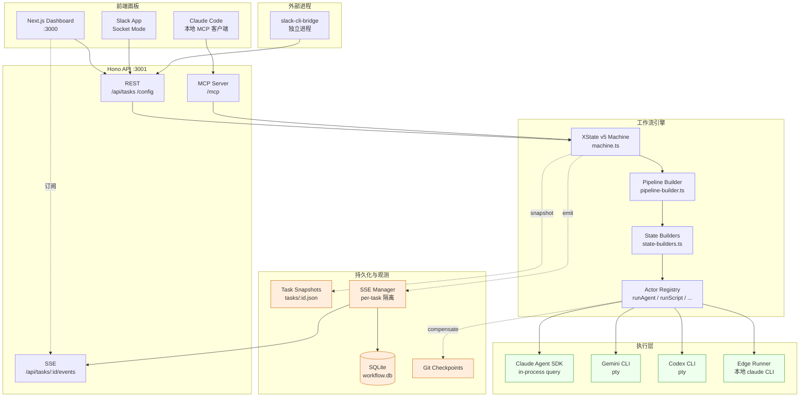

**看图要点**
- 三种触发方 (Web / Slack / Claude Code) 走同一条通道：REST 或 MCP 进入 Hono，最终驱动同一份 XState machine。
- 引擎本身与执行层解耦：machine 只管 state，actor 才调用具体 SDK / CLI。
- SSE 和 snapshot 是**旁路写**，不参与主流程决策，只做观测与恢复。
- `slack-cli-bridge` 是独立进程，**不是** server 的一部分，它通过 HTTP 调用 server。

**源码锚点**
- Hono 入口: `apps/server/src/index.ts`
- Machine 工厂: `apps/server/src/machine/machine.ts:41`
- MCP server: `apps/server/src/edge/mcp-server.ts`
- Slack bridge: `apps/slack-cli-bridge/src/index.ts`

---

### 1.2 组件依赖

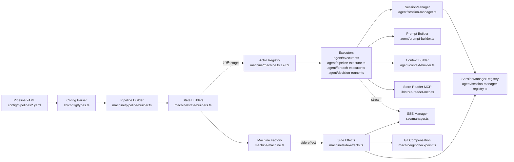

**看图要点**
- YAML → parser → builder → state builders → machine 是**纯构建链**，不涉及执行。
- Executors 与 prompt/context/MCP 并列，各司其职；SessionManager 被 agent executor 使用，但由 registry 集中管理。
- Side effects 是 XState `emit` 的消费者，**不直接被 state 引用**，解耦策略让重试/恢复不会重复触发副作用（除非显式设计）。

---

### 1.3 宿主与执行面

Workflow control 有三种真实的执行形态，容易混淆，这里用一张图澄清。

```mermaid
flowchart TB
  subgraph Local[本地执行模式 默认]
    direction LR
    L1[HTTP POST /api/tasks] --> L2[XState machine 驻留在 server 进程]
    L2 --> L3[runAgent / runAgentSingleSession<br/>直接调用 Claude SDK query]
    L3 --> L4[同进程返回结果<br/>累计 cost/token]
  end

  subgraph EdgeMode[Edge 执行模式]
    direction LR
    E1[Edge Runner<br/>本地用户机器] --> E2[pnpm edge -- --trigger ...]
    E2 --> E3[pty 启动 claude CLI]
    E3 --> E4[MCP 回连 server<br/>claim_stage / submit_result]
    E4 --> E5[server 收到结果<br/>推进 machine]
  end

  subgraph Hybrid[Slack CLI Bridge]
    direction LR
    H1[Slack 消息] --> H2[slack-cli-bridge<br/>独立进程]
    H2 --> H3[ProcessManager 启动 claude CLI]
    H3 --> H4[通过 HTTP 喂回 server]
  end

  classDef local fill:#e8f4ff
  classDef edge fill:#fff3e0
  classDef hybrid fill:#f0f0f0
  class L1,L2,L3,L4 local
  class E1,E2,E3,E4,E5 edge
  class H1,H2,H3,H4 hybrid
```

**看图要点**
- **本地模式**最高效：agent 直接在 server 进程里用 SDK query，零 IPC 开销，cost/token 统计精准。
- **Edge 模式**解决"server 不能在用户机器上执行代码"的场景：用户本地跑 claude CLI，通过 MCP 把结果回传给 server。
- **Slack CLI Bridge** 是为长会话交互场景设计的，和前两者平行存在，不是主路径。

---

## 第二层：运行时机理

### 2.1 Task 生命周期状态

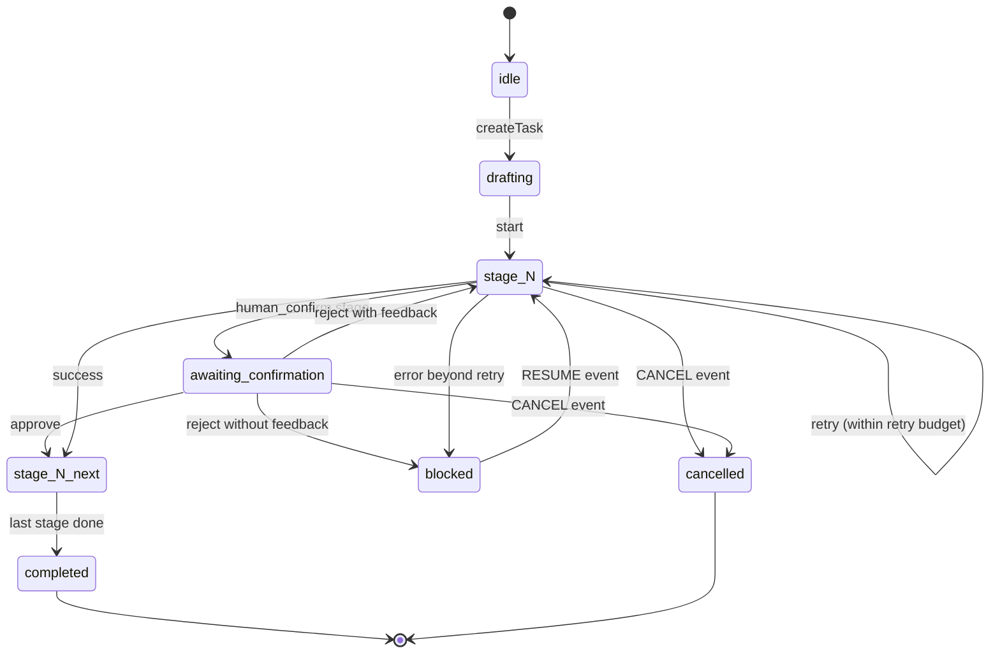

**看图要点**
- `blocked` 是可恢复状态，`cancelled` 是终止状态。
- `human_confirm` 的 reject 分两种：带 feedback 回到本 stage（将 feedback 注入下一次 agent 对话），不带 feedback 则 block 等待人工介入。
- `CANCEL` 事件从任何 state 都能进（side-effects.ts 会一并清理 session）。

**源码锚点**
- State 转移定义: `apps/server/src/machine/state-builders.ts` 各 build* 函数
- Cancel / Interrupt 全局处理: `apps/server/src/machine/machine.ts:74-100`

---

### 2.2 Stage 执行时序

以 `agent` stage 为例（multi-session 模式）：

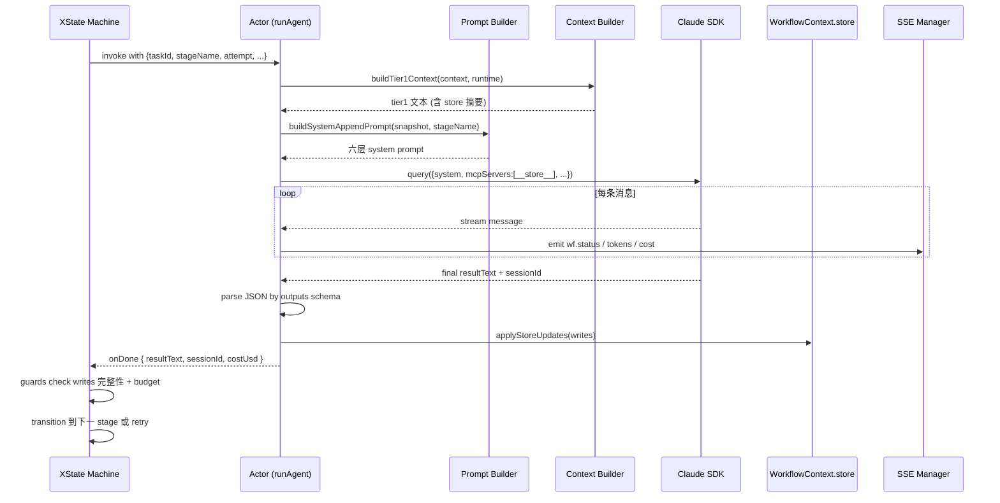

**看图要点**
- Prompt / context 构建在 actor **内部**完成，machine 不感知提示细节。
- SDK 的流式消息通过 SSE 旁路出去，**不阻塞** actor 主路径。
- `onDone` 之后才由 machine 的 guard 决定是否重试（例如 writes 缺字段）。

**源码锚点**
- Actor 入口: `apps/server/src/agent/executor.ts:55` (`runAgent`)
- Prompt 组装: `apps/server/src/agent/prompt-builder.ts:21`
- Store 更新: `apps/server/src/machine/state-builders.ts:84-99`
- Guards 示例: `state-builders.ts:1458-1466`

---

### 2.3 XState Machine 结构

Pipeline 动态编译为如下层级：

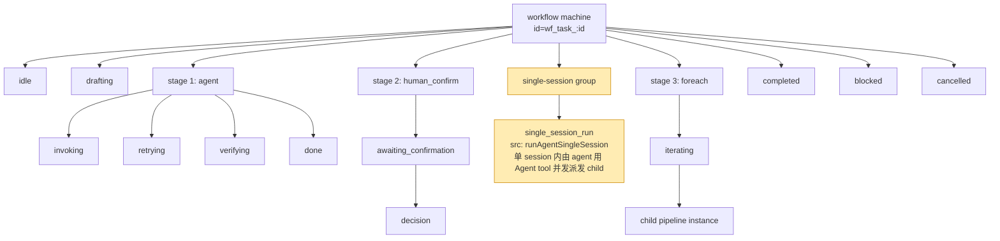

**看图要点**
- 每个 stage 在顶层是平行兄弟 state，通过 transition 串联，而不是嵌套。
- **single-session group** 是特殊节点：**整组内部不存在 XState 子 state**，所有 child 在一个 actor invoke 里顺序跑完（见 2.4）。
- `foreach` 通过 actor 内部循环实现，而不是展开成 N 个子 state。

**源码锚点**
- 编译入口: `apps/server/src/machine/pipeline-builder.ts`
- agent state 子状态: `state-builders.ts:171` (`buildAgentState`)
- single-session group: `state-builders.ts:1388` (`buildSingleSessionParallelState`)

> 📌 **语义澄清**：`buildSingleSessionParallelState` 在**单一 session 对话内**由 agent 通过 Claude SDK 的 Agent tool **并发派发**所有 child stages（见 `session-manager.ts:711-760` `executeParallelGroup`，dispatch prompt 明确写 "Launch ALL child stages simultaneously using the Agent tool"）。源码注释里的 "sequentially" 指的是**对话连续性**（同一个 conversation 线程），不是 child 执行串行。child 之间依然是真并发，只是运行在同一父 session 中。

---

### 2.4 Session 管理与清理

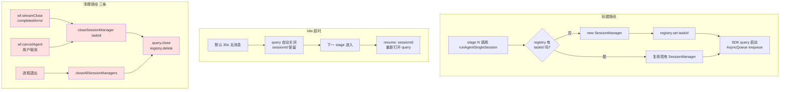

**看图要点**
- Single-session 的核心是"**一个 taskId ↔ 一个 SessionManager ↔ 一个 query**"的映射。
- 跨 stage 的对话历史靠 query 本身保留；short idle 关闭后靠 `resume: sessionId` 重建。
- **清理路径是齐全的**（三条都存在），无泄漏风险。

**源码锚点**
- SessionManager: `apps/server/src/agent/session-manager.ts:106`
- Registry: `apps/server/src/agent/session-manager-registry.ts:18`
- 清理钩子: `apps/server/src/machine/side-effects.ts:111` (完成/错误), `:179` (取消)
- 进程级清理: `apps/server/src/index.ts:173-174`

#### 2.4.1 Compact 优化（Single-Session 模式）

在 single-session 模式下，会话历史随 stage 累积持续增长。SDK 在 token 接近上下文窗口上限时自动触发 compact（压缩），PreCompact hook 确保压缩过程保留 pipeline 关键上下文。

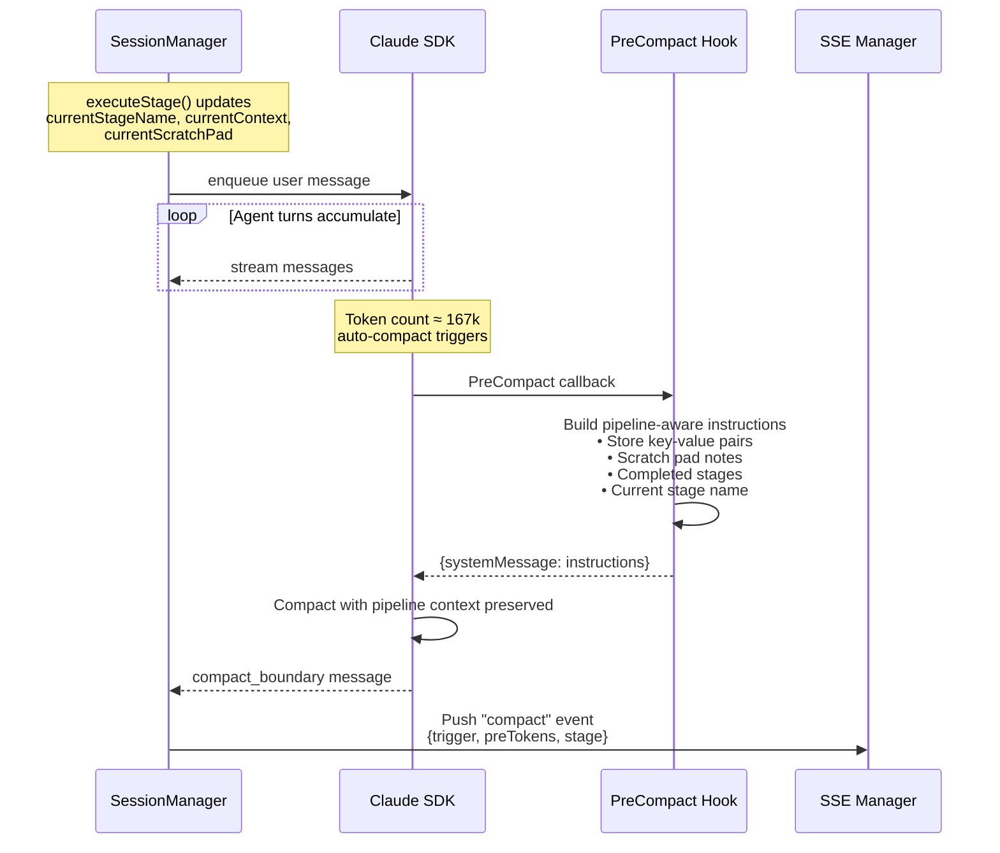

**看图要点**
- PreCompact hook 在 SDK 自动压缩前被调用，注入 pipeline 感知的指令，确保压缩 LLM 保留 store 状态、scratch pad、stage 进度等关键信息。
- Hook 通过 SessionManager 的 mutable 字段读取当前 stage 上下文，这些字段在 executeStage() 开始时同步更新，不存在竞态条件（同一事件循环）。
- compact_boundary 消息被观测并推送为 SSE 事件，提供压缩可观测性。

**源码锚点**
- PreCompact hook 注册: `session-manager.ts:241`
- compactHook 方法: `session-manager.ts:408`
- compact_boundary 处理: `session-manager.ts:737`
- Mutable 字段更新: `session-manager.ts:153-157`

---

### 2.5 Context Tier 与 Store 数据流

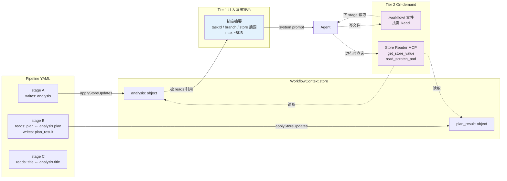

**看图要点**
- **Tier 1** 是"一次性注入"的纯文本，走 system prompt 通道，随 cache prefix 复用。
- **Tier 2** 是"按需拉取"的通道：大数据放 `.workflow/` 文件让 agent 用 Read 工具读；结构化数据走 `__store__` MCP。
- `reads` 声明哪些 store key 进 Tier 1，`writes` 声明本 stage 产出哪些 key。未声明的 store key 不会出现在 Tier 1。

**源码锚点**
- Tier 1 构建: `apps/server/src/agent/context-builder.ts:76`
- Store 写入策略: `apps/server/src/machine/state-builders.ts:84-99` (replace / append / merge)
- Store Reader MCP: `apps/server/src/lib/store-reader-mcp.ts:11`

---

### 2.6 Prompt 六层组装

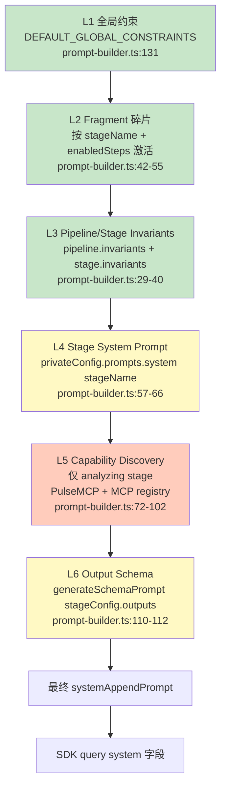

**看图要点**
- 层次从**宽到窄**：全局 → 碎片 → 管线/阶段 invariants → 阶段本身 → 阶段运行时发现 → 输出 schema。
- L1–L3 相对稳定，对 prompt cache 友好；L4–L6 按 stage 变化。
- **Fragment 激活规则**：stage 名匹配 + enabled_steps 交集 + 关键词匹配。同一 stage 多次执行，激活集合可能不同（capability discovery 影响）。

**源码锚点**
- 主函数: `apps/server/src/agent/prompt-builder.ts:21` (`buildSystemAppendPrompt`)
- 静态前缀: `:131` (`buildStaticPromptPrefix`)

---

## 第三层：能力对照

### 3.1 Stage 类型对照表

| Stage Type     | Engine          | 关键配置                                | Actor                      | 典型用途                          | 源码位置                           |
|----------------|-----------------|---------------------------------------|----------------------------|----------------------------------|-----------------------------------|
| `agent`        | `llm`           | `system_prompt`, `reads`, `writes`, `max_turns`, `budget_usd` | `runAgent` / `runAgentSingleSession` | Claude/Gemini 执行复杂推理任务 | `state-builders.ts:171`           |
| `script`       | `script`        | `command`, `inputs`, `env`            | `runScript`                | git worktree、PR、构建、确定性操作 | `state-builders.ts:690`           |
| `human_confirm`| `human_gate`    | `template`, `reject_target`           | —（由 machine 等待外部事件）| 人工审批、反馈回路                | `state-builders.ts:767`           |
| `condition`    | `condition`     | `branches[].when`                     | —（纯 guard 决策）          | 基于 store 做分支                 | `state-builders.ts:938`           |
| `llm_decision` | `llm_decision`  | `question`, `options`, `context`      | `runLlmDecision`           | 小模型快速做路由决策              | `state-builders.ts:1113`          |
| `pipeline`     | `pipeline`      | `pipeline_name`, `inputs`, `outputs`  | `runPipelineCall`          | 嵌套调用另一个 pipeline           | `state-builders.ts:1020`          |
| `foreach`      | `foreach`       | `items`, `concurrency`, `child`       | `runForeach`               | 批量处理 items（可并发）          | `state-builders.ts:1067`          |

所有 stage 共享字段：`writes` / `reads` / `retry` / `compensation` / `verify_commands` / `verify_policy` / `verify_max_retries`。详见 `apps/server/src/lib/config/types.ts:22-170`。

---

### 3.2 Single-Session vs Multi-Session

| 维度                     | Multi-Session（默认）                       | Single-Session                                        |
|--------------------------|-------------------------------------------|------------------------------------------------------|
| 触发配置                 | 不设 `session_mode` 或 `"multi"`          | `session_mode: single` + parallel group 声明         |
| Actor                    | `runAgent`                                | `runAgentSingleSession`                              |
| 每 stage 是否新开 query  | 是                                         | **否**，共享一个 query                                 |
| 对话历史                 | 不跨 stage                                 | 跨 stage 累积                                         |
| Prompt cache 复用        | 每 stage 重新 build prefix                | prefix 一次构建，后续 stage 追加 tier1Context + stagePrompt；auto-compact 后 PreCompact hook 保留 pipeline 关键上下文 |
| 压缩策略                 | N/A（每 stage 独立 session）              | PreCompact hook 注入 pipeline 感知指令；tier1Context 每 stage 重新注入 |
| 并行执行                 | XState parallel state 级并行（每 child 独立 query） | **单 session 内** agent 用 Agent tool 并发派发 child |
| 失败重试粒度             | 单 stage 重试                              | **整组重试**（SDK resume 只能整 session 恢复；可通过 stageCheckpoints 做迂回，见 P2） |
| Idle 超时                | N/A                                       | 默认 30s，超时后 `resume: sessionId` 恢复              |
| 适用场景                 | stage 间耦合弱、想 cost 隔离、允许并发     | stage 间强依赖、需要 agent 持续上下文推理              |

**重试粒度说明**：single-session 模式下，整个 group 作为一个 XState 节点，失败时重跑整组。Claude Agent SDK 的 `resume: sessionId` 只支持"整个 session 完整恢复"，不能截断到某个 child 边界，所以**在 XState 层**无法优雅回退到单个 child。但项目里已经有 `stageCheckpoints`（`stage-executor.ts:112-120`）给单 stage 中断续跑用——这是 P2 的迂回方案基础。

---

### 3.3 Actor 注册表

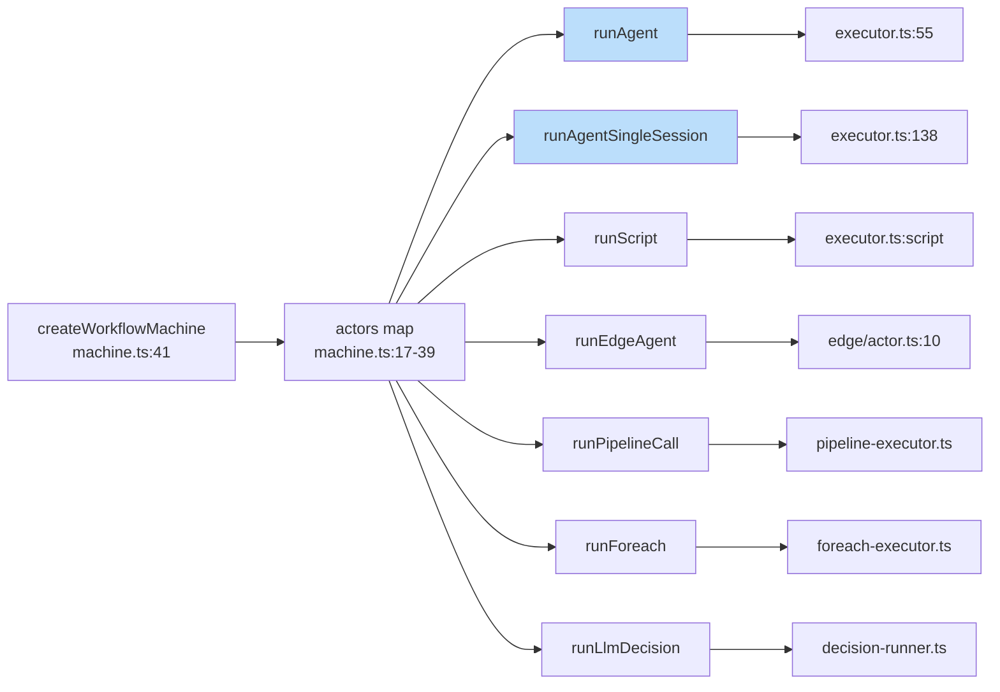

**看图要点**
- 每个 actor 都被 `loggedActor()` 包装过，用于统一日志与错误捕获（machine.ts:17）。
- `runAgent` 和 `runAgentSingleSession` 是**仅有**的两个需要 SessionManager 的 actor。

---

### 3.4 SSE 事件清单

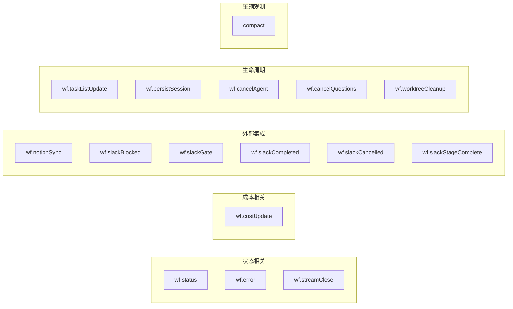

源码: `apps/server/src/machine/events.ts:3-18` + `side-effects.ts` 的 handler。

---

## 第四层：已知问题与防御措施

本节描述系统当前状态下的已知问题、已实施的防御措施，以及仍待解决的缺陷。与白皮书 §16 互补。

### 已实施的防御措施

| 类别 | 防御措施 | 源码位置 |
|------|---------|---------|
| 校验 | Zod schema 对 max_retries/max_turns/max_budget_usd 等数值字段强制 `.int().min()` 边界 | `lib/config/types.ts` |
| 校验 | Condition stage 的 `when` 表达式在 pipeline 构建期通过 `expr-eval` 预校验 | `pipeline-builder.ts` |
| 校验 | 并行组内 writes 冲突检测支持 object-form `WriteDeclaration`，允许 `append` 策略并发写入 | `pipeline-builder.ts:299-313` |
| 校验 | 跨 stage 的 writes key 重复（replace 策略）在构建期发出 warn 日志 | `pipeline-builder.ts` |
| 校验 | Fragment 去重采用 whitespace normalization + `Set<string>`，覆盖空白差异场景 | `prompt-builder.ts` |
| 安全 | SSE 广播经 `redactSensitive()` 过滤 key pattern（api_key/token/secret）和 value pattern（sk-/ghp_/xox-/AKIA/eyJ） | `lib/redact.ts` |
| 并发 | SessionManager registry 构造后 double-check，防御未来异步化的 TOCTOU 风险 | `session-manager-registry.ts` |
| 执行限制 | Turn limit 两阶段强制：soft（注入停止消息）+ hard（maxTurns+5 后 `query.interrupt()`） | `session-manager.ts` |
| 执行限制 | Turn budget 感知：stage 开始时若 SDK 剩余 turn 不足本 stage 配额，注入效率警告 | `session-manager.ts:buildStagePrompt` |
| 成本 | Gemini cost 三级估算：CLI 报告 → per-model 聚合 → token 估算（Flash/Pro 分别定价） | `gemini-executor.ts:estimateGeminiCost` |
| 生成安全 | Pipeline 生成结果包含 `hasStubs`/`stubStages` 字段，标记使用了 fallback stub 的 stage | `pipeline-generator.ts` |
| 错误处理 | Git compensation 失败记录到 `context.compensationFailures` 数组，供重试逻辑和前端展示 | `helpers.ts` |
| 可观测 | SSE DB 写入失败从静默 catch 改为 `taskLogger.warn` | `sse/manager.ts` |
| Session | SessionManager 清理路径齐全：任务完成/出错（`side-effects.ts:111`）、取消（`:179`）、进程退出（`index.ts:173`） | 三处 |

### 并行组并发语义说明

Single-session 模式下的 "parallel group" 并发有两个层次，容易混淆：

- **Multi-session**：每个 child 独立 SDK query，XState 层并发
- **Single-session**：一个 SDK query，agent 层用 Agent tool 并发派发 child（`session-manager.ts` `executeParallelGroup`，dispatch prompt 写 "Launch ALL child stages simultaneously using the Agent tool"）

XState 视角只看到 `runAgentSingleSession` 一个 invoke，child 的并发对外层不可见（cost/token 按整组粒度聚合）。

### Single-session 整组重试限制

Claude Agent SDK 的 `resume: sessionId` 只能整个 session 完整恢复，无法截断到某个 child 边界。从 XState 层看，group 失败时只能整组重试。已有 `stageCheckpoints` 机制可作为未来 per-child 增量恢复的基础，但尚未实现。

### 仍待解决的问题

当前无重大未解决问题。以下为已知的设计取舍，暂不视为缺陷：

- SDK 创建后 `maxTurns` 不可动态调整，turn budget 感知只能通过 prompt 层面的效率提示缓解，无法彻底消除饿死风险
- Gemini cost 估算基于已知定价表，新模型上线时需手动更新 `GEMINI_PRICING`
- Skeleton prompt 瘦身后仍约 ~3K tokens，进一步压缩需平衡生成质量

#### 已排除的误报

| 原始报告 | 排除原因 |
|---------|---------|
| SSE 重连丢消息 | `sse/manager.ts:98-112` 重放最多 500 条 + 前端 `seenMessageIdsRef` 去重 |
| Task list SSE 重连空档 | `task-list-broadcaster.ts:65-69` 每次新连接发 `task_list_init` 全量快照 |
| Gemini JSON 解析脆弱 | `gemini-executor.ts:407` 有 catch-all fallback，未知消息类型静默跳过 |
| Legacy snapshot 迁移 | `persistence.ts:92-94` 按 `version === SNAPSHOT_VERSION` 守门 |

---

### 已解决的关键问题

#### Session 历史膨胀（原 CRITICAL，已解决）

Single-session pipeline 中 SDK 对话历史跨 stage 无限增长。通过三重修复解决：

1. **PreCompact hook** — `createQuery()` 注册 `PreCompact` hook，在 SDK auto-compact 触发时（~167k tokens）注入 pipeline 感知指令，保留 store 键值对、scratch pad、已完成 stage 列表、当前 stage 名称
2. **tier1Context 重新注入** — `buildStagePrompt()` 对每个 stage 都注入 tier1Context，auto-compact 摘要化旧 tier1 后仍保证 agent 拥有完整任务上下文
3. **Store MCP 无条件刷新** — `switchStageConfig()` 每次 stage 切换无条件调用 `setMcpServers()`，确保 `__store__` MCP 反映最新 store/scratchPad 数据

```
┌────────────────────────────────────────────────────────────┐
│              SDK Session (single session mode)              │
│                                                            │
│  Stage A: 20 turns ──┐                                    │
│  Stage B: 20 turns ──┤  SDK auto-compact fires at ~167k   │
│                       ▼                                    │
│  PreCompact hook injects:                                  │
│    - store.* key-value snapshot                            │
│    - scratchPad notes (last 20)                            │
│    - completed stage list                                  │
│    - current stage name                                    │
│                       ▼                                    │
│  Stage C prompt = [compacted history (pipeline-aware)      │
│                    + fresh tier1Context + stagePrompt]      │
│                                                            │
│  compact_boundary -> SSE "compact" event for observability │
└────────────────────────────────────────────────────────────┘
```

**源码**: `session-manager.ts` — hook 注册 `:241`, compactHook `:408`, compact_boundary `:737`, mutable 字段 `:133-137`

#### Tier1 上下文丢失（原 MEDIUM，已解决）

`buildStagePrompt()` 现无条件注入 `tier1Context`，每 stage 额外 ~2-5k tokens，消除了 agent 需要 2-4 轮 MCP 调用才能获取 store 数据的问题。

**源码**: `session-manager.ts:buildStagePrompt`

#### Turn budget 饿死 + 软限制（原 HIGH，已解决）

- **Hard turn limit**: 达到 `maxTurns` 后注入 soft stop 消息，再过 5 个 turn 仍未停止则 `query.interrupt()` 强制截断
- **Budget 感知**: `buildStagePrompt()` 检测 SDK 剩余 turn 数，不足时注入效率警告
- **总 turn 追踪**: 新增 `totalTurnCount` 跨 stage 累计

**源码**: `session-manager.ts` — hard limit、budget 感知均在 `consumeUntilResult` 和 `buildStagePrompt` 中

#### Gemini cost 报 $0（原 MEDIUM，已解决）

`estimateGeminiCost()` 三级策略：优先使用 CLI 直接报告的 `stats.cost_usd`，其次聚合 `stats.models[*].cost_usd`，最后基于 token 数按 Flash/Pro 分别定价估算。Codex 已有类似机制。

**源码**: `gemini-executor.ts:estimateGeminiCost`

#### 生成 stub 运行时崩溃（原 MEDIUM，已解决）

`GenerateResult` 新增 `hasStubs: boolean` 和 `stubStages: string[]` 字段。Fallback script 错误消息改为 `[STUB]` 前缀，明确提示需手动编辑。

**源码**: `pipeline-generator.ts`

#### Skeleton prompt 膨胀（原 MEDIUM，已解决）

移除一个冗余示例 pipeline（保留一个），压缩 advanced stage runtimes 接口定义为单行说明。Prompt 体积从 ~4K tokens 降至 ~3K tokens。

**源码**: `pipeline-generator.ts:buildSkeletonPrompt`

#### `.__summary` 死代码（原 LOW，已解决）

移除 `context-builder.ts` 中 `mechanicalSummaryKey` 查找和 `store[semanticSummaryKey]` fallback，移除 `actor-registry.ts` 中 `.__summary`/`.__semantic_summary` 继承代码。语义摘要现仅通过 `getCachedSummary()` 内存缓存获取。

#### 跨 stage writes 冲突（原 LOW，已解决）

`pipeline-builder.ts` 构建期新增全局 writes key 追踪。多个 stage 以 replace 策略写同一 key 时发出 warn 日志，帮助 pipeline 作者发现无意覆盖。

---

## 与白皮书的章节映射

| 本文章节                          | 白皮书对应章节                                 |
|----------------------------------|---------------------------------------------|
| 1.1 系统拓扑                      | §3 架构拓扑                                   |
| 1.2 组件依赖                      | §2 系统总览 + §4 工作流引擎核心                 |
| 1.3 宿主与执行面                  | §8 执行模式                                    |
| 2.1 Task 生命周期                 | §4.1 XState v5 作为基础                        |
| 2.2 Stage 执行时序                | §5.1 Agent Stage                               |
| 2.3 XState Machine 结构           | §4.2 Context 模型 + §4.3 状态机编译            |
| 2.4 Session 管理                  | （白皮书未覆盖，本文新增，对应 0ad0f23 提交）    |
| 2.5 Context Tier / Store          | §6 数据流与 Store 模型                          |
| 2.6 Prompt 六层                   | §7 Prompt 工程架构                              |
| 3.1 Stage 类型对照                | §5 Stage 类型体系                               |
| 3.2 Single vs Multi Session       | （白皮书未覆盖，本文新增）                       |
| 3.3 Actor 注册表                  | §4.4 Actor 注册表                               |
| 3.4 SSE 事件                      | §12 可观测性与实时事件流                         |
| 第四层 已知问题与防御措施           | §16 已知缺陷与客观评估（互补）                    |

---

## 维护说明

- 本文与白皮书**并列**，不替代白皮书。修改时：图与图注、源码锚点必须同步。
- 若源码位置变动（行号漂移），优先用 Grep 重新定位，而不是直接删除锚点。
- 新增 stage type 或 actor 时，至少要更新：1.2 组件依赖、2.3 machine 结构、3.1 对照表、3.3 actor 注册表四处。
