# Workflow Control —— 白皮书可视化

> Version 2.0 · 2026-05-03 · 配套 [`whitepaper-zh.md`](./whitepaper-zh.md)
>
> 取代 `architecture-visual.md`（已 archived 2026-04-24）。
>
> 英文版：[`whitepaper-visuals.md`](./whitepaper-visuals.md)。

本文是 v2.0 白皮书的**视觉伙伴**。下面每张图都通过 GitHub
markdown + Mermaid 渲染。每张图配上对应白皮书章节，配合阅读。

---

## §1. 系统拓扑

> 白皮书 §3.1。

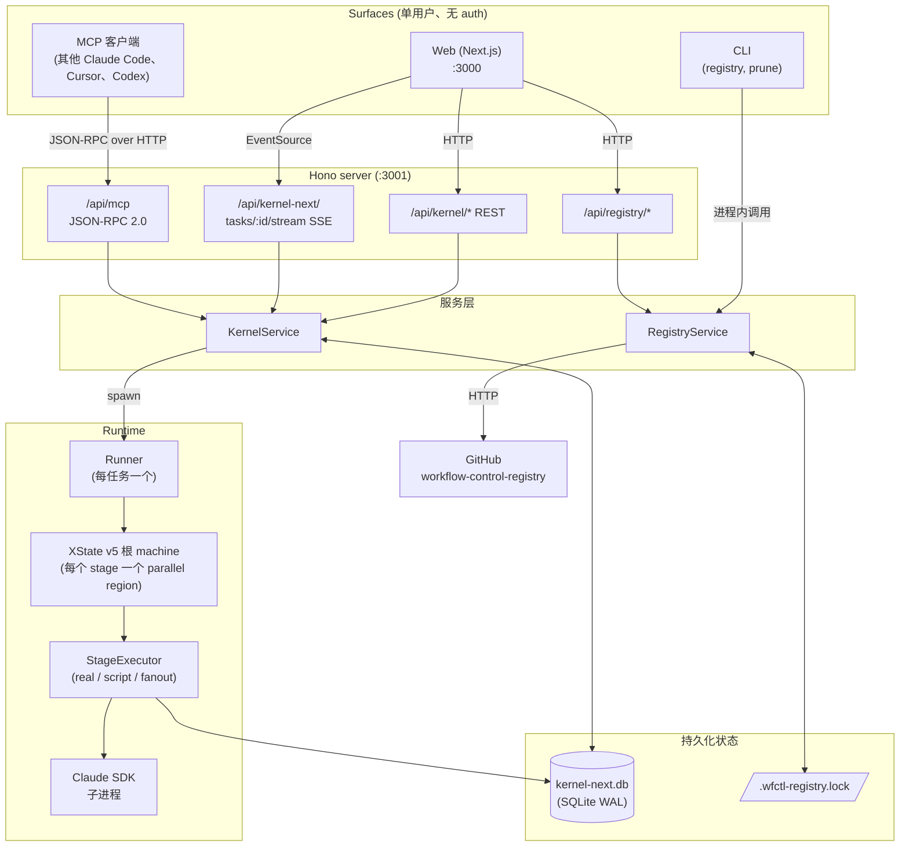

---

## §2. Pipeline IR —— 注册的是什么

> 白皮书 §3.2。

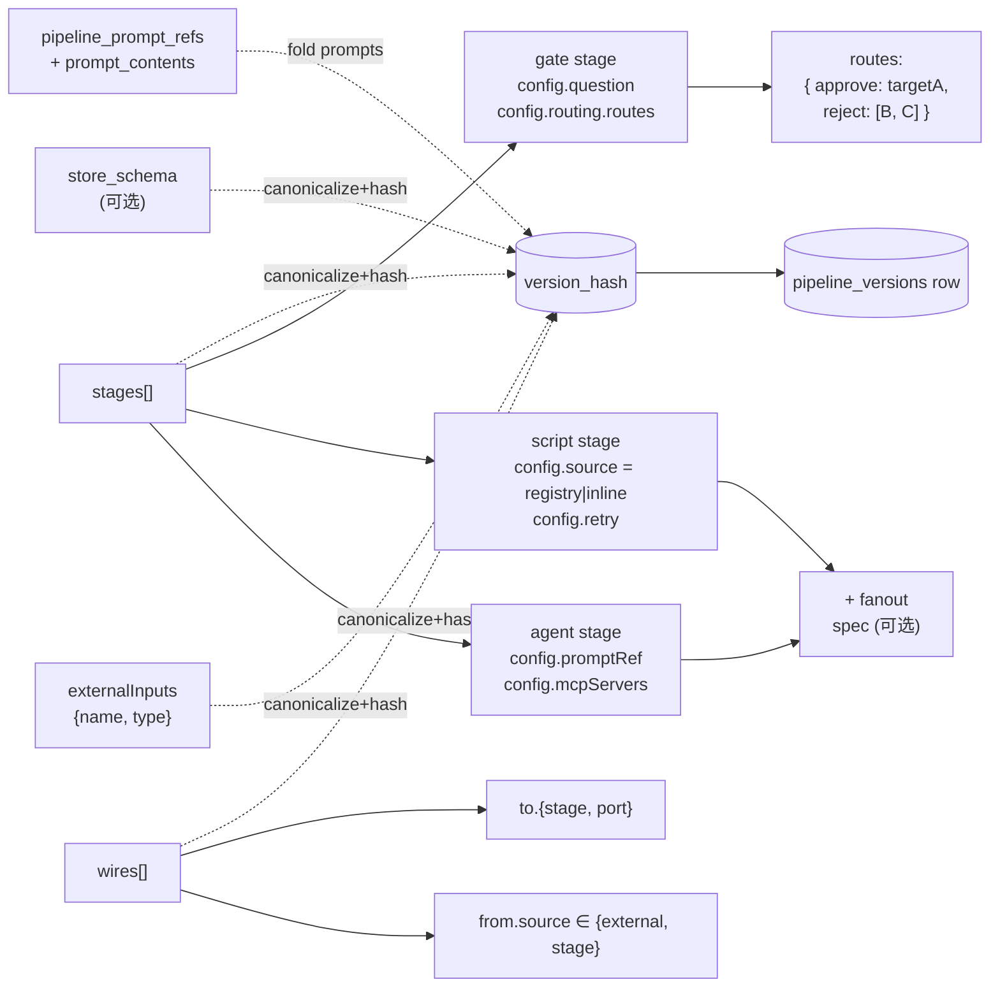

要点：`version_hash = pipelineVersionHash({ ir, prompts })`。
白皮书 §3.2 详述；代码在 `ir/canonical.ts`。

---

## §3. Stage region 状态机（每 stage 一个，并行）

> 白皮书 §3.3。

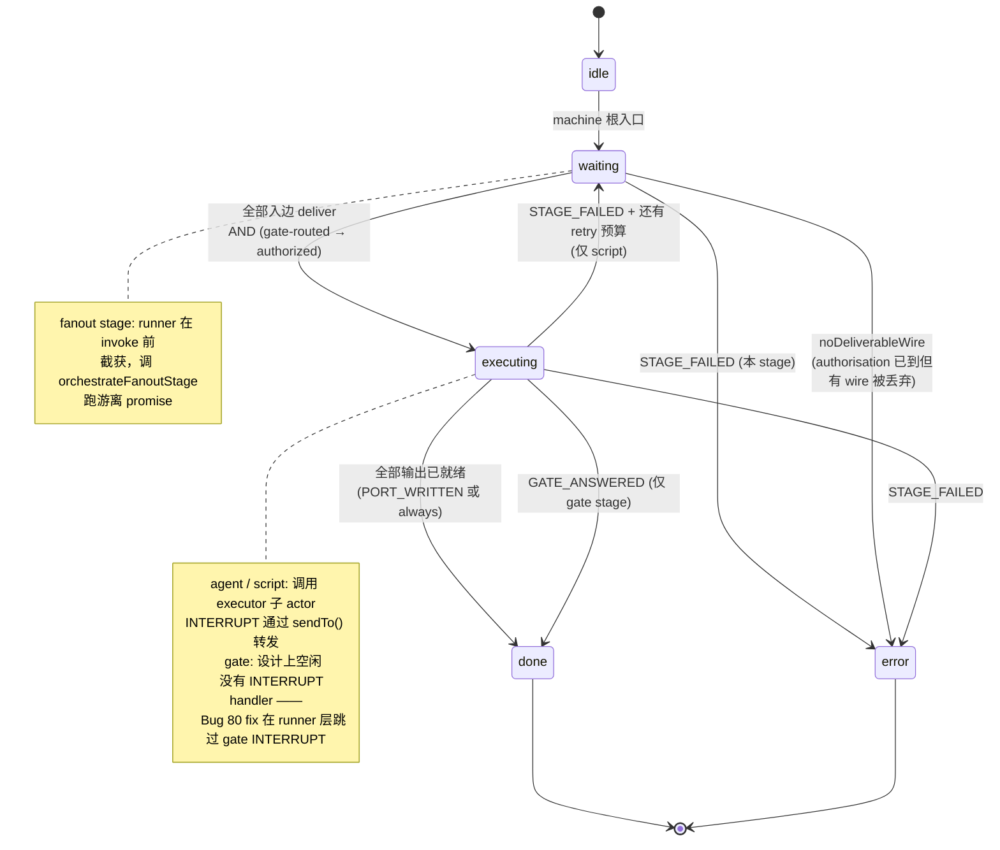

Runner 监听 inspector snapshot，看到 `error` final 时构造 verdict
（natural / retry / rollback）。代码：`compiler/ir-to-machine.ts`
+ `runtime/runner.ts`。

---

## §4. Task 生命周期（顶层）

> 白皮书 §1.1 + §3.4。

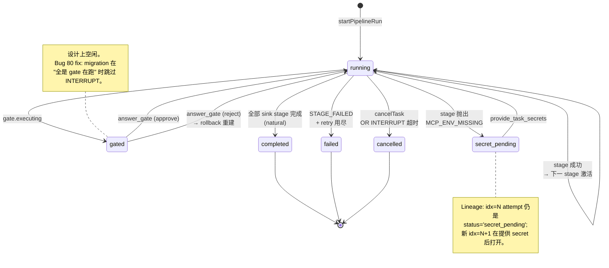

---

## §5. Reject-rollback —— 多目标

> 白皮书 §2.3 + dogfood-8/11。

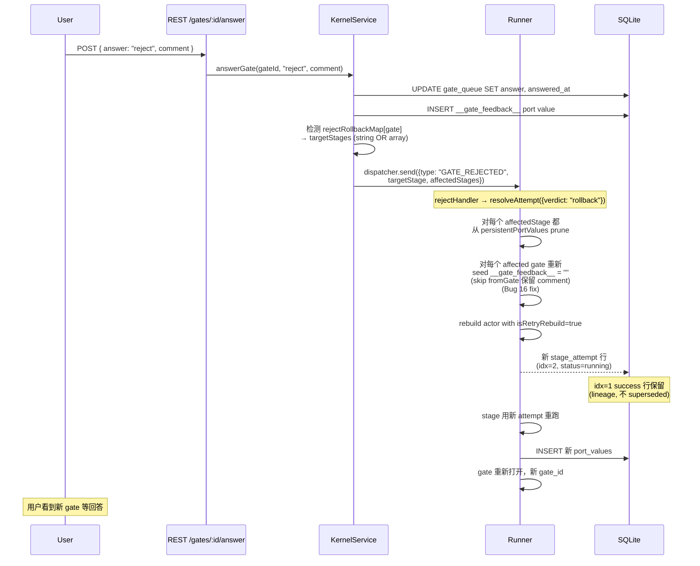

---

## §6. 热更新迁移

> 白皮书 §3.5 + dogfood-10/12/13。

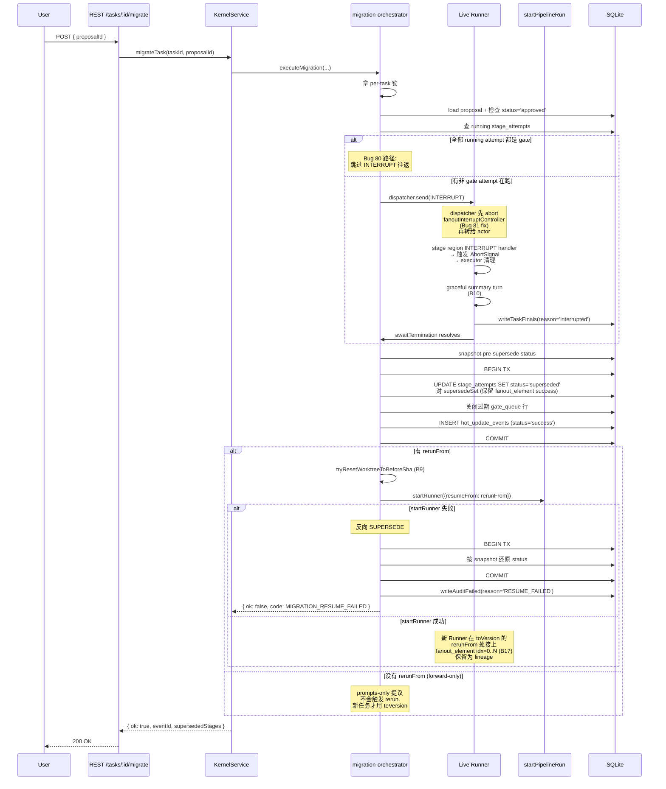

---

## §7. 重启后的可恢复性

> 白皮书 §3.6。

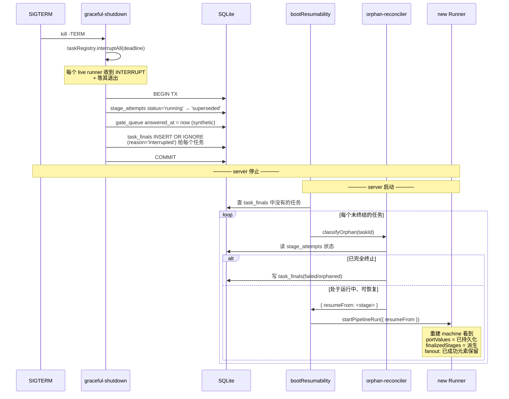

---

## §8. Fanout 执行

> 白皮书 §3.3（注释）+ dogfood-12。

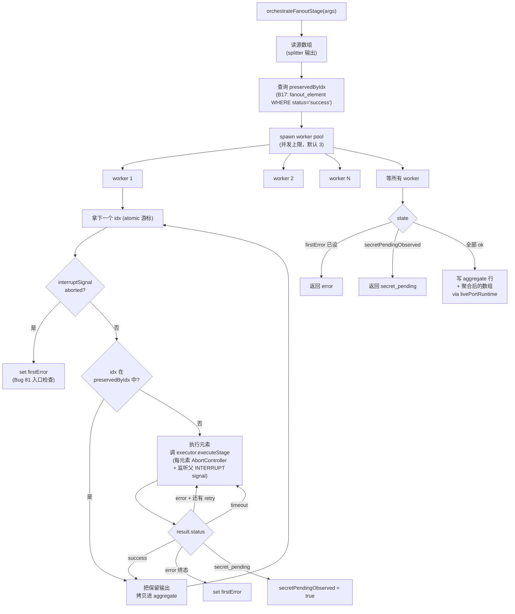

---

## §9. Web UI surface map

> 白皮书 §4.1。

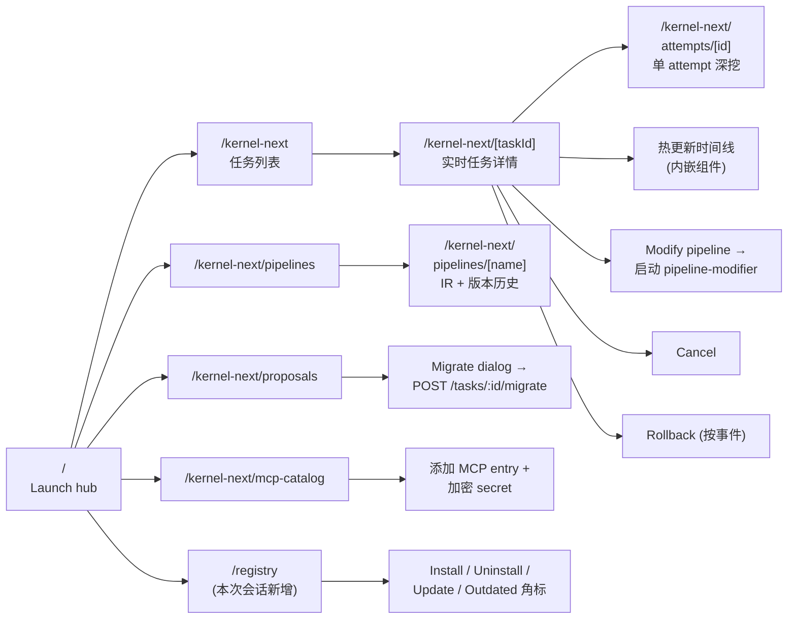

---

## §10. Bug 修复要点 —— 接线图

dogfood 期间浮现的三个 bug 定义了当前跨 stage 类型的 INTERRUPT 故事。

### §10.1 Bug 16 —— gate-feedback 重新 seed

> dogfood-5/6。

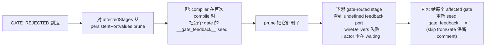

### §10.2 Bug 80 —— gated 任务 INTERRUPT 超时

> dogfood-10。

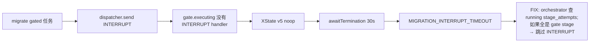

### §10.3 Bug 81 —— fanout 不响应 INTERRUPT

> dogfood-13。

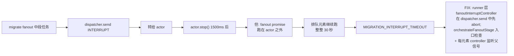

---

## §11. 数据库 —— 主要表与连接路径

> 白皮书 §4.3。

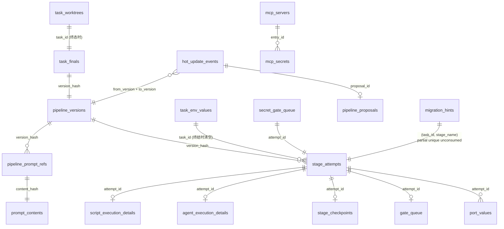

这套 schema 的关键质量：**所有跨表连接都按 `attempt_id` 或
`version_hash`**，从不按 `task_id + stage_name + idx` 字符串。这就
是为什么 lineage 查询又快又无歧义——lineage 行永远存活，因为它
们绑在产生它的具体 attempt 上。

---

## §12. Dogfood 时间线 —— 我们交付了什么

> 白皮书 §5；详细叙述见
> `docs/superpowers/dogfood-2026-04-28/handoff-dogfood-11-12-13.md`。

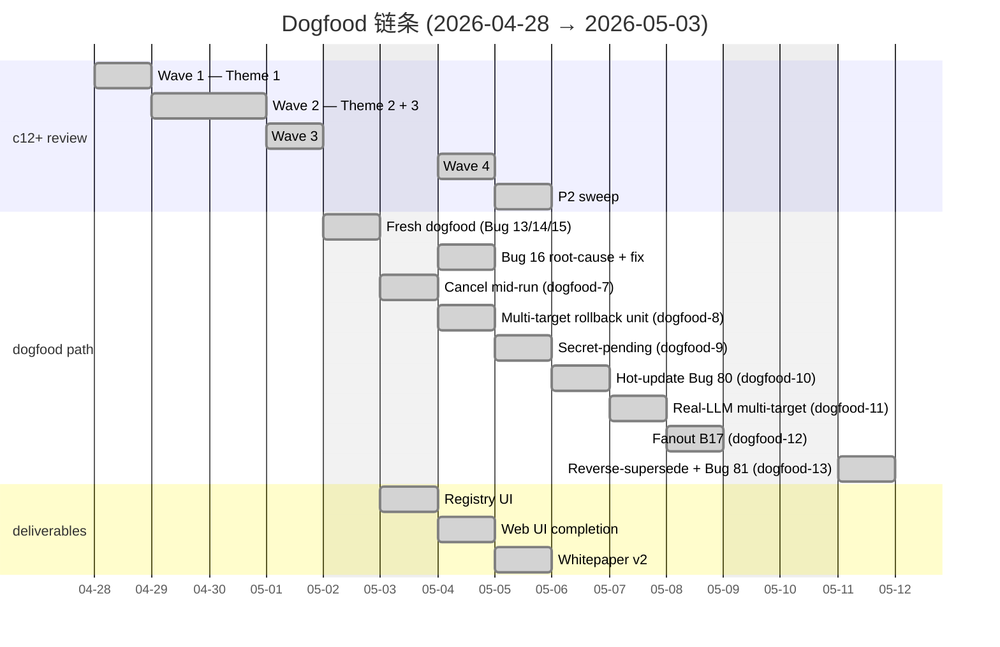

---

## §13. 累计交付物

> 白皮书 §6（限制）划定边界；本节是边界内的成绩单。

| 产物 | 数量 |
|---|---|
| Server 测试 | 251 文件 / 2,374 测试通过 |
| Web 测试 | 13 文件 / 66 测试通过 |
| Registry-service 测试 | 65（unit + adversarial） |
| 修复 bug | c12+ → dogfood-13 共 81 |
| c12+ 闭环以来 commit | ~50 |
| HTTP 路由（kernel-next） | 18（含 SSE） |
| MCP 工具 | 17 |
| Web 页面 | 9 |
| TSC 干净 TypeScript 行数 | ≈ 60K (server) + ≈ 18K (web) |

---

**可视化文档 v2.0 完。**

更新规则：bump version + 在新章节加 §N。不要修 legacy
`architecture-visual.md`。
