# Workflow Control — Whitepaper Visuals

> Version 2.0 · 2026-05-03 · companion to [`whitepaper.md`](./whitepaper.md)
>
> Supersedes `architecture-visual.md` (archived 2026-04-24).
>
> **Chinese version**: [`whitepaper-visuals-zh.md`](./whitepaper-visuals-zh.md).

This file is the **visual companion** to the v2.0 whitepaper. Every
diagram below renders in GitHub-flavoured Markdown via Mermaid. Pair
each diagram with the cited whitepaper Part for the prose.

---

## §1. System topology

> Whitepaper Part 3.1.

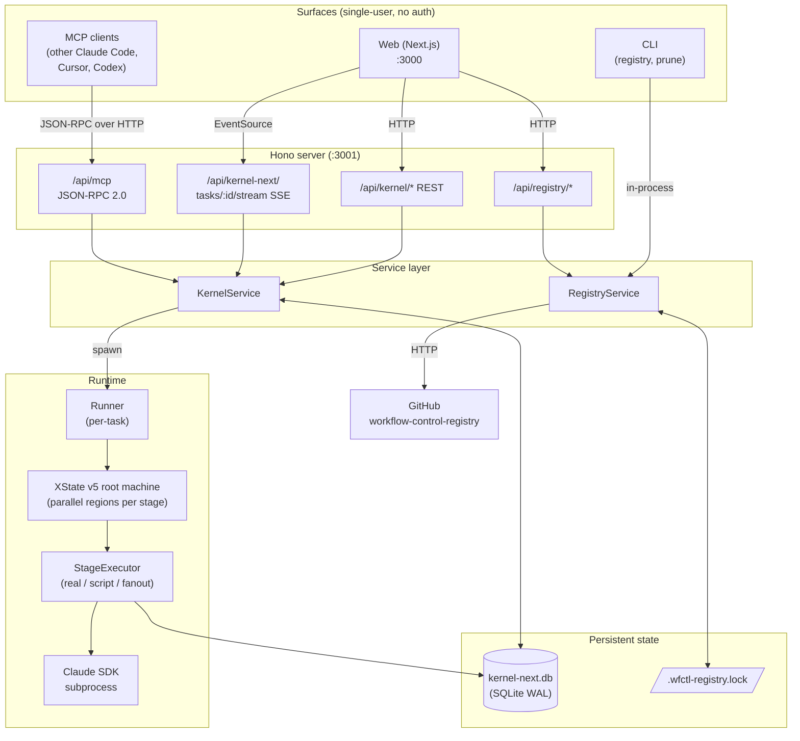

---

## §2. Pipeline IR — what gets registered

> Whitepaper Part 3.2.

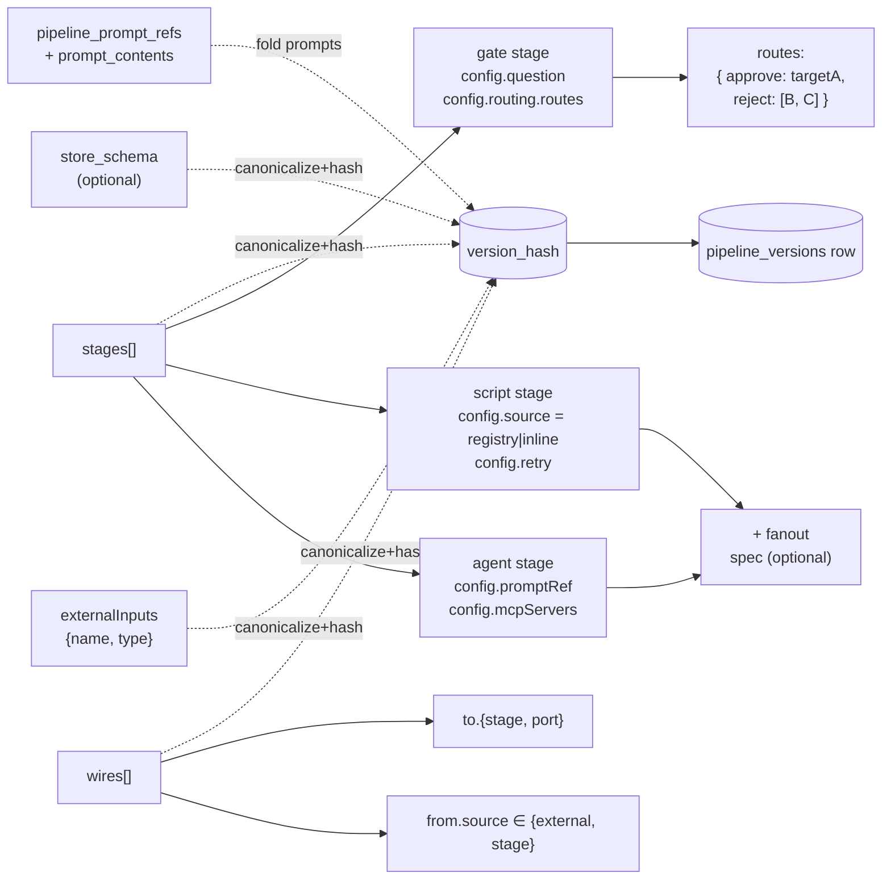

Key: `version_hash = pipelineVersionHash({ ir, prompts })`.
Whitepaper §3.2 detail; code in `ir/canonical.ts`.

---

## §3. Stage region state machine (per stage, parallel)

> Whitepaper Part 3.3.

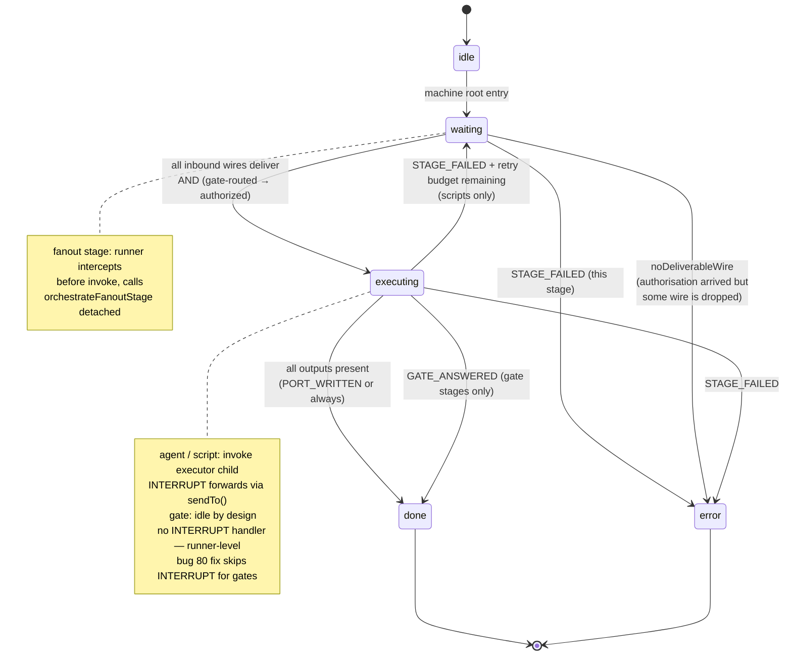

The runner watches inspector snapshots for `error` finals to build a
verdict (natural / retry / rollback). Code: `compiler/ir-to-machine.ts`
+ `runtime/runner.ts`.

---

## §4. Task lifecycle (top-level)

> Whitepaper Part 1.1 + 3.4.

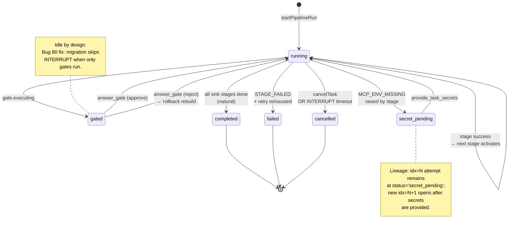

---

## §5. Reject-rollback — multi-target

> Whitepaper Part 2.3 + dogfood-8/11.

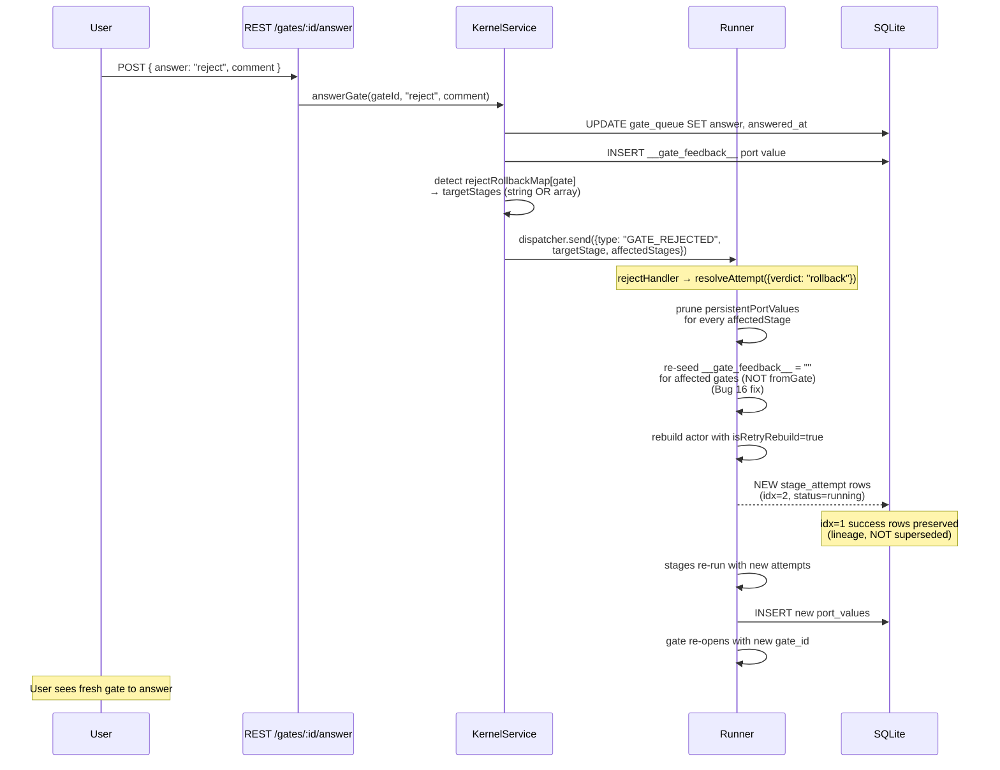

---

## §6. Hot-update migration

> Whitepaper Part 3.5 + dogfood-10/12/13.

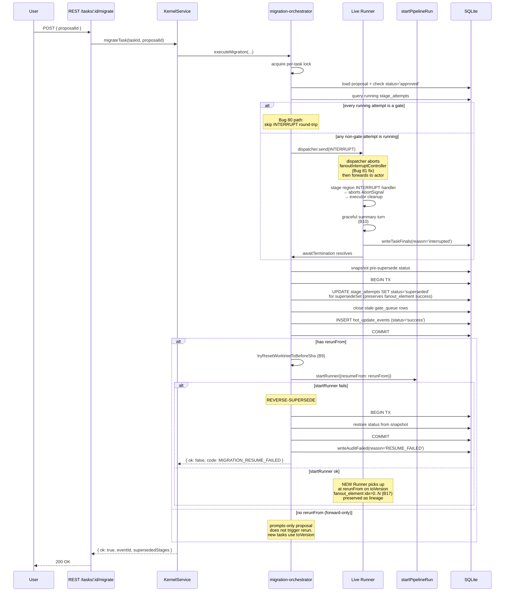

---

## §7. Resumability after restart

> Whitepaper Part 3.6.

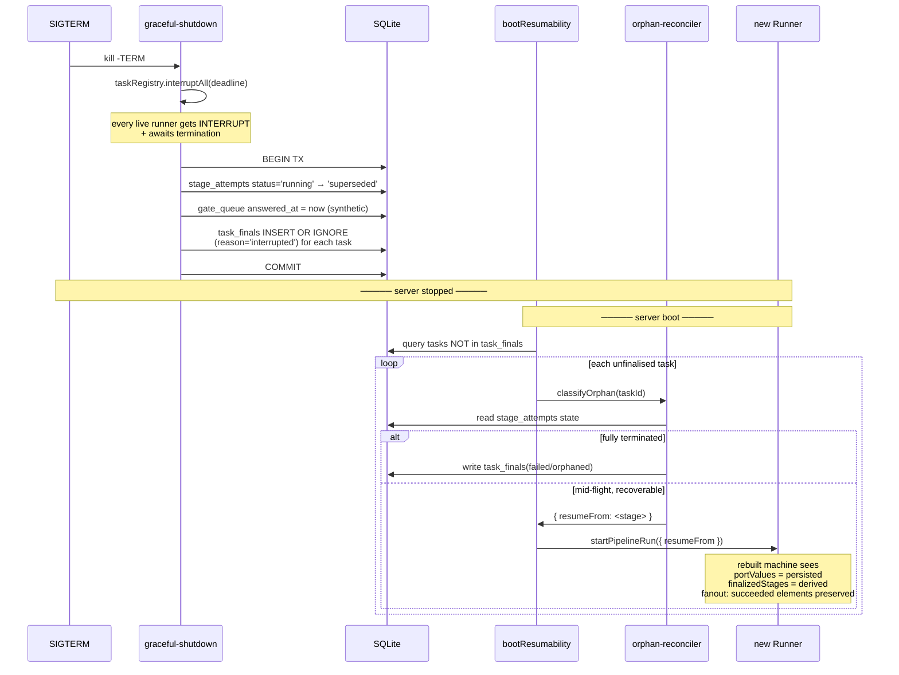

---

## §8. Fanout execution

> Whitepaper Part 3.3 (note) + dogfood-12.

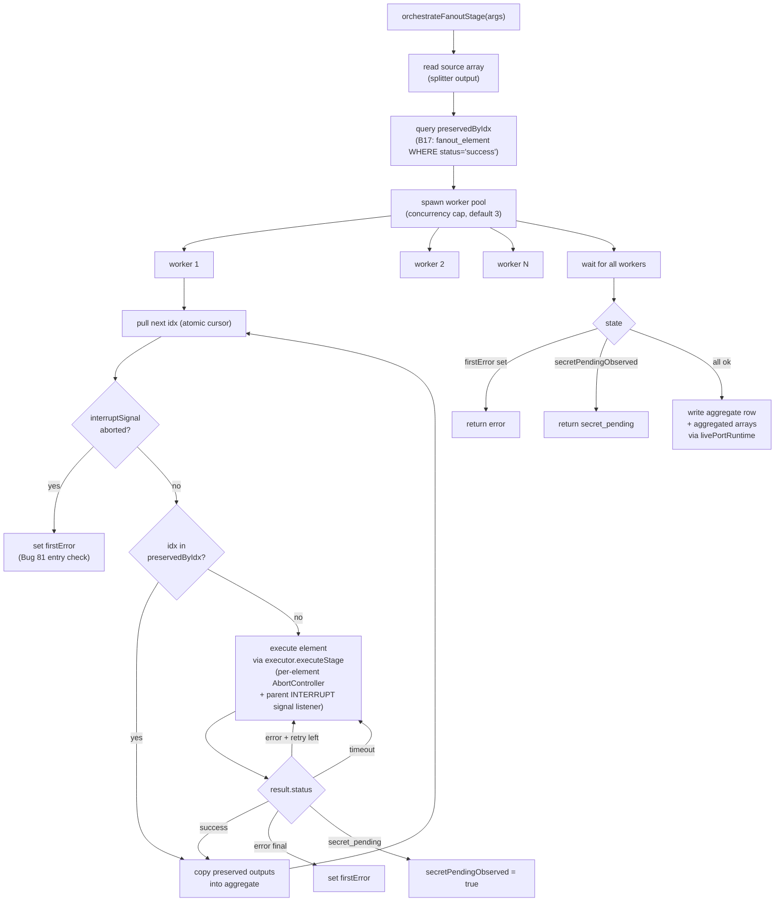

---

## §9. The web UI surface

> Whitepaper Part 4.1.

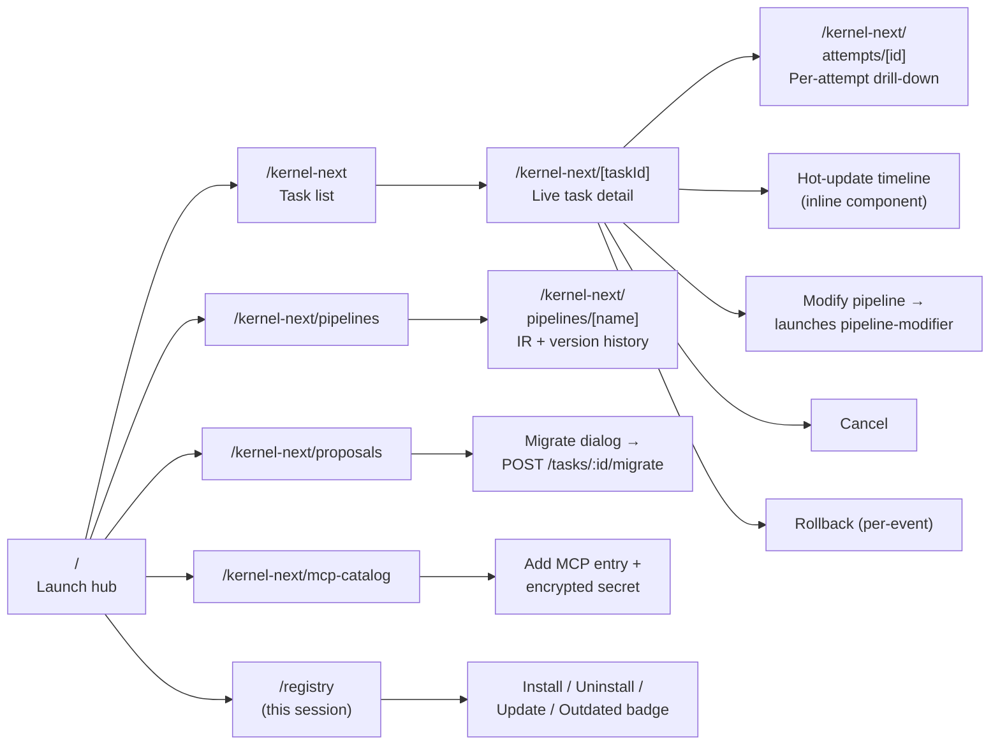

---

## §10. Bug-fix highlights — the wire diagrams

Three bugs surfaced during dogfood that defined the current
INTERRUPT story across stage types.

### §10.1 Bug 16 — gate-feedback re-seed

> dogfood-5/6.

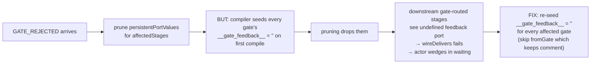

### §10.2 Bug 80 — gated task INTERRUPT timeout

> dogfood-10.

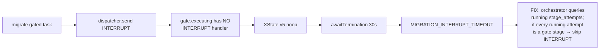

### §10.3 Bug 81 — fanout doesn't observe INTERRUPT

> dogfood-13.

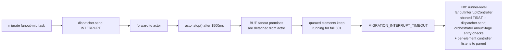

---

## §11. Database — primary tables and their join paths

> Whitepaper Part 4.3.

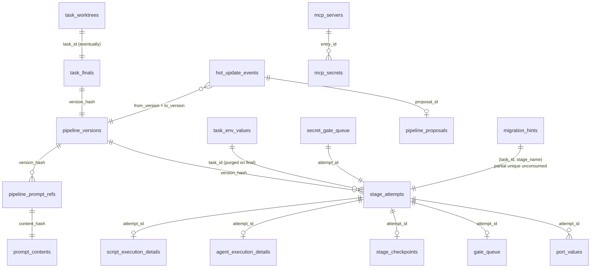

A key quality of this schema: **every cross-table join is by
`attempt_id` or `version_hash`**, never by `task_id + stage_name + idx`
strings. This is why lineage queries are fast and unambiguous —
lineage rows live forever even after retries because they're
attached to the specific attempt that produced them.

---

## §12. The dogfood arc — what we shipped

> Whitepaper Part 5; full prose in
> `docs/superpowers/dogfood-2026-04-28/handoff-dogfood-11-12-13.md`.

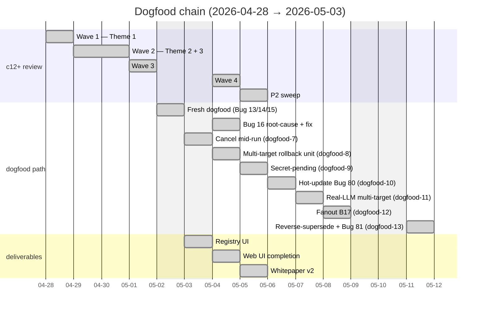

---

## §13. Cumulative deliverables

> Whitepaper Part 6 (limitations) sets the boundary; this is the
> inside-the-boundary scoreboard.

| Artifact | Count |
|---|---|
| Server tests | 251 files / 2,374 tests pass |
| Web tests | 13 files / 66 tests pass |
| Registry-service tests | 65 (unit + adversarial) |
| Bugs found+fixed | 81 across c12+ → dogfood-13 |
| Commits since c12+ closure | ~50 |
| HTTP routes (kernel-next) | 18 (incl. SSE) |
| MCP tools surfaced | 17 |
| Web pages | 9 |
| Lines of TSC-clean TypeScript | ≈ 60K (server) + ≈ 18K (web) |

---

**End of visuals v2.0.**

Updates: bump version + add §N new for new diagrams. Don't edit the
legacy `architecture-visual.md`.
